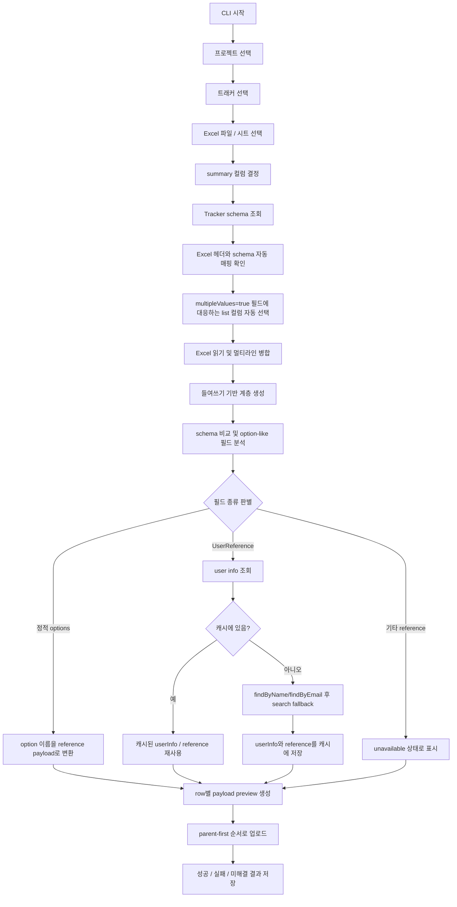

# 아키텍처

## 개요

이 프로젝트는 Excel 기반 계층형 데이터를 Codebeamer Tracker Item payload로 변환하고 업로드하는 자동화 파이프라인입니다.

코드베이스는 크게 다섯 계층으로 나뉩니다.

1. 엔트리 포인트
2. Excel 처리
3. schema 및 매핑
4. payload 모델과 오케스트레이션
5. Codebeamer API 접근

## 주요 모듈

### 엔트리 포인트

- `cli_main.py`: 현재 권장 인터랙티브 CLI
- `main.py`: 과거 엔트리 포인트, 현재 비권장

### Excel 처리

`src/excel_processor.py`

주요 책임:
- `xlwings`로 워크북과 시트를 열기
- 헤더와 데이터 행 읽기
- summary 셀의 들여쓰기 수준 감지
- 여러 물리적 행을 하나의 논리 레코드로 병합
- 들여쓰기 기준으로 parent-child 관계 계산
- wizard가 사용하는 upload dataframe 생성

주요 산출물:
- `raw_df`
- `merged_df`
- `hierarchy_df`
- `upload_df`

### schema 및 매핑

`src/mapping_service.py`

주요 책임:
- tracker schema를 dataframe 형태로 평탄화
- upload 컬럼과 schema 필드 비교
- option-like 필드 감지
- schema의 정적 options로 이름 매핑 테이블 생성
- `multipleValues=true` 필드에 매핑된 Excel 컬럼 계산
- Excel option 값 검증
- 지원되는 option 값을 Codebeamer reference 형식으로 변환

현재 반영된 포인트:
- 감지 기준이 `has_options` 하나에만 의존하지 않음
- `reference_type`, `Choice` value model, `ReferenceField`, `OptionChoiceField` 도 함께 감지
- `UserReference` 는 별도 lookup 대상으로 분류
- 정적 option이 없는 일반 reference field는 `OPTION_SOURCE_UNAVAILABLE` 로 명시적으로 드러냄

### payload 모델과 상태

`src/models/`

주요 책임:
- reference 및 field value payload 모델 정의
- `to_dict()` 기반 payload 직렬화
- 타입 문자열과 상태 문자열을 enum 및 공통 상수로 관리
- `UserInfo` 로 Codebeamer 사용자 상세 응답 모델링
- `WizardState` 로 업로드 세션 상태 표현
- `TrackerItemBase` 를 통해 tracker item payload 구성

핵심 모델:
- `TrackerItemBase`
- `ChoiceFieldValue`
- `TextFieldValue`
- `TableFieldValue`
- `UserInfo`
- `WizardState`

### 오케스트레이션

`src/wizard.py`

주요 책임:
- API client, Excel processor, mapping service를 조합해 전체 흐름 제어
- 업로드 세션 상태 유지
- row 단위 payload preview 생성
- `TableField` custom field 조립
- `UserReference` 를 user info 조회 후 reference로 변환
- 프로젝트 단위 user lookup cache 유지
- parent-first 순서로 업로드 수행
- 실행 산출물 저장

### API 접근

`src/codebeamer_client.py`

주요 책임:
- 인증 세션 구성
- 프로젝트, 트래커, schema, 아이템 조회
- 사용자 조회 API 호출
- 신규 tracker item 생성

현재 사용자 API helper:
- `GET /v3/users/{userId}`
- `GET /v3/users/findByName`
- `GET /v3/users/findByEmail`
- `POST /v3/users/search`

## 최신 업로드 순서도

## End-to-End 흐름

1. 사용자가 `cli_main.py`를 실행합니다.
2. CLI가 config, logger, client, mapper, wizard를 초기화합니다.
3. 사용자가 project와 tracker를 선택합니다.
4. CLI가 tracker schema를 먼저 조회합니다.
5. Excel 헤더와 schema의 자동 매핑을 확인합니다.
6. 매핑 결과와 schema의 `multipleValues`를 기준으로 list 컬럼을 자동 선택합니다.
7. wizard가 Excel을 읽고 `raw_df`, `merged_df`, `hierarchy_df`, `upload_df`를 생성합니다.
8. CLI와 wizard가 schema 비교 결과를 준비합니다.
9. mapping service가 option-like 필드를 감지하고 resolution 전략을 결정합니다.
10. 정적 option은 reference dict로 해석합니다.
11. `UserReference` 는 user info를 조회하고 `__resolved`, `__user_info` 컬럼에 반영합니다.
12. user lookup 결과는 `WizardState.user_lookup_cache` 에 저장해 다음 행에서 재사용합니다.
13. wizard가 payload preview를 생성합니다.
14. wizard가 parent-first 순서로 업로드합니다.
15. state와 실행 결과를 `output/`에 저장합니다.

## 상태 모델

`WizardState`는 업로드 파이프라인 전체의 스냅샷 역할을 합니다.

일반적인 생명주기:
- 먼저 `project_id`, `tracker_id`가 선택됨
- `list_cols` 가 schema 기반으로 자동 결정됨
- Excel 읽기 후 `raw_df`, `merged_df`, `hierarchy_df`, `upload_df`가 채워짐
- schema 로딩 후 `schema`, `schema_df`, `comparison_df`가 채워짐
- option 처리 후 `option_candidates_df`, `option_maps`, `option_check_df`, `converted_upload_df`가 채워짐
- 사용자 lookup 중간 결과는 `user_lookup_cache` 에 유지됨
- upload 수행 후 `upload_result`가 채워짐

## TableField 처리 방식

기대하는 Excel 헤더 형식:
- `TableFieldName.ColumnName`

처리 흐름:
1. schema flattening 단계에서 `TableField` 정의와 하위 컬럼 목록 식별
2. wizard가 일치하는 Excel 컬럼 탐지
3. row 값들을 `TableFieldValue` 구조로 묶음
4. 업로드 전에 plain dict로 직렬화

## Option 및 Reference 처리 방식

정적 option 처리:
- schema에 `options` 배열이 있음
- Excel 값과 option 이름을 비교
- `{id, name, type}` 형태의 reference dict로 변환

`UserReference` 처리:
- 이름 또는 이메일을 기준으로 사용자 조회
- 우선 `findByName` 또는 `findByEmail` 시도
- 단건이 안 잡히면 `users/search` 로 fallback
- exact match가 1건이면 `UserInfo` 와 `UserReference` 로 저장
- 결과는 프로젝트 단위 캐시에 alias와 함께 보관

기타 reference 처리:
- schema에는 reference type이 있으나 정적 options는 없음
- 현재는 `reference_lookup` 으로 분류
- 검증 단계에서 `OPTION_SOURCE_UNAVAILABLE` 표시
- unresolved 값이 남아 있으면 payload preview/upload 시 명확한 오류 발생

## 권장 조합

현재 가장 권장되는 실행 조합:
- `cli_main.py`
- `src/mapping_service.py`
- `src/wizard.py`
- `src/models/`

## UML 문서

- `docs/class-diagram.puml`
- `docs/upload-sequence.puml`
