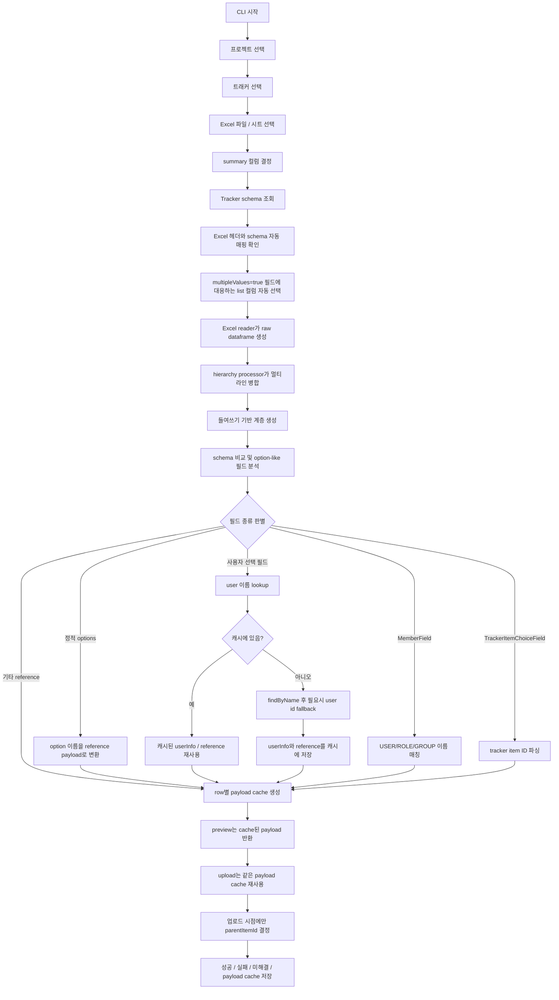

# 아키텍처

## 개요

이 프로젝트는 Excel 기반 계층형 데이터를 Codebeamer Tracker Item payload로 변환하고 업로드하는 자동화 파이프라인입니다.

코드베이스는 크게 여섯 계층으로 나뉩니다.

1. 엔트리 포인트
2. 입력 reader
3. hierarchy processor
4. schema 및 매핑
5. payload 모델과 오케스트레이션
6. Codebeamer API 접근

## 주요 모듈

### 엔트리 포인트

- `cli_main.py`: 현재 권장 인터랙티브 CLI
- `main.py`: 과거 엔트리 포인트, 현재 비권장

### 입력 reader

`src/excel_reader.py`

주요 책임:
- `xlwings`로 워크북과 시트를 열기
- 헤더와 데이터 행 읽기
- summary 셀의 들여쓰기 수준 감지
- raw dataframe 반환
- `_excel_row`, `_summary_indent` 메타 컬럼 부여

주요 산출물:
- `raw_df`

### hierarchy processor

`src/hierarchy_processor.py`

주요 책임:
- 여러 물리적 행을 하나의 논리 레코드로 병합
- 들여쓰기 기준으로 parent-child 관계 계산
- wizard가 사용하는 upload dataframe 생성

주요 산출물:
- `merged_df`
- `hierarchy_df`
- `upload_df`

호환 참고:
- `src/excel_processor.py` 는 기존 import 경로를 위한 얇은 래퍼다.

### schema 및 매핑

`src/mapping_service.py`

주요 책임:
- tracker schema를 dataframe 형태로 평탄화
- upload 컬럼과 schema 필드 비교
- payload 규칙 기준 field 분류
- schema의 정적 options로 이름 매핑 테이블 생성
- `multipleValues=true` 필드에 매핑된 Excel 컬럼 계산
- Excel option/reference 값 검증
- 지원되는 option/reference 값을 Codebeamer payload 형식으로 변환

현재 반영된 포인트:
- `type` 을 1차 기준으로 field를 해석
- `referenceType`, `options`, `multipleValues`, `valueModel` 로 보조 판정
- `UserChoiceField`, `UserReference` 는 사용자 이름 우선 lookup 대상으로 분류
- `MemberField` 는 `USER/ROLE/GROUP` mixed member lookup 대상으로 분류
- `TrackerItemChoiceField` 는 tracker item ID direct parse 대상으로 분류
- `Status` 는 transition 기반 후처리가 필요하므로 TODO 로 분리
- 정적 option이 없는 일반 reference field는 `LOOKUP_REQUIRED` 또는 `FIELD_UNSUPPORTED` 로 조기 노출

확장 참고:
- 새로운 field type 지원 절차는 [필드 지원 추가 가이드](./field-support-guide.md)에 정리되어 있습니다.

### payload 모델과 상태

`src/models/`

주요 책임:
- reference 및 field value payload 모델 정의
- `to_dict()` 기반 payload 직렬화
- 타입 문자열과 상태 문자열을 enum 및 공통 상수로 관리
- `UserInfo` 로 Codebeamer 사용자 응답을 최소 reference 구조로 정규화
- `WizardState` 로 업로드 세션 상태 표현
- `TrackerItemBase` 를 통해 tracker item payload 구성

핵심 모델:
- `TrackerItemBase`
- `ChoiceFieldValue`
- `TextFieldValue`
- `TableFieldValue`
- `TrackerItemReference`
- `UserInfo`
- `WizardState`

### 오케스트레이션

`src/wizard.py`

주요 책임:
- API client, reader, hierarchy processor, mapping service를 조합해 전체 흐름 제어
- 업로드 세션 상태 유지
- raw dataframe 기반 후처리 실행
- row 단위 payload cache 생성
- cache된 payload preview 제공
- `TableField` custom field 조립
- 사용자 선택 필드를 사용자 이름 우선 lookup 후 reference로 변환
- `MemberField` 를 `USER/ROLE/GROUP` mixed reference 로 변환
- tracker item 선택 필드를 tracker item ID parse 후 reference로 변환
- 프로젝트 단위 user lookup cache 유지
- parent-first 순서로 업로드 수행
- 실행 산출물 저장

### API 접근

`src/codebeamer_client.py`

주요 책임:
- 인증 세션 구성
- 프로젝트, 트래커, schema, 아이템 조회
- 사용자 조회 API 호출
- 신규 tracker item 생성

현재 사용자/멤버 API helper:
- `GET /v3/users/{userId}`
- `GET /v3/users/findByName`
- `GET /v3/users/groups`
- `GET /v3/trackers/{trackerId}/fields/{fieldId}/permissions`

## 최신 업로드 순서도

## End-to-End 흐름

1. 사용자가 `cli_main.py`를 실행합니다.
2. CLI가 config, logger, client, mapper, wizard를 초기화합니다.
3. 사용자가 project와 tracker를 선택합니다.
4. CLI가 tracker schema를 먼저 조회합니다.
5. Excel 헤더와 schema의 자동 매핑을 확인합니다.
6. 매핑 결과와 schema의 `multipleValues`를 기준으로 list 컬럼을 자동 선택합니다.
7. Excel reader가 raw dataframe을 만들고 `_excel_row`, `_summary_indent` 메타정보를 붙입니다.
8. hierarchy processor가 `raw_df`, `merged_df`, `hierarchy_df`, `upload_df`를 생성합니다.
9. CLI와 wizard가 schema 비교 결과를 준비합니다.
10. mapping service가 field type을 해석하고 resolution 전략을 결정합니다.
11. 정적 option은 reference dict로 해석합니다.
12. 사용자 선택 필드는 사용자 이름으로 조회하고 필요시 숫자 입력에 한해 ID fallback 을 사용합니다.
13. `MemberField` 는 `USER/ROLE/GROUP` 후보를 이름으로 찾아 mixed reference 로 변환합니다.
14. tracker item 선택 필드는 입력값에서 tracker item ID를 파싱해 `TrackerItemReference` 로 변환합니다.
15. user/member lookup 결과는 cache 에 저장해 다음 행에서 재사용합니다.
16. wizard가 row별 payload를 먼저 계산해 `payload_df` cache에 저장합니다.
17. preview는 `payload_df`를 재사용하고 upload는 같은 payload로 parent-first 업로드를 수행합니다.
18. `Status` transition 후처리는 아직 TODO 입니다.
19. state와 실행 결과를 `output/`에 저장합니다.

## 상태 모델

`WizardState`는 업로드 파이프라인 전체의 스냅샷 역할을 합니다.

일반적인 생명주기:
- 먼저 `project_id`, `tracker_id`가 선택됨
- `list_cols` 가 schema 기반으로 자동 결정됨
- Excel 읽기 후 `raw_df`, `merged_df`, `hierarchy_df`, `upload_df`가 채워짐
- schema 로딩 후 `schema`, `schema_df`, `comparison_df`가 채워짐
- option 처리 후 `option_candidates_df`, `option_maps`, `option_check_df`, `converted_upload_df`가 채워짐
- payload 생성 후 `payload_df` 가 채워짐
- 사용자 lookup 중간 결과는 `user_lookup_cache` 에 유지됨
- upload 수행 후 `upload_result`가 채워짐

## TableField 처리 방식

기대하는 Excel 헤더 형식:
- `TableFieldName.ColumnName`

처리 흐름:
1. schema flattening 단계에서 `TableField` 정의와 하위 컬럼 목록 식별
2. wizard가 일치하는 Excel 컬럼 탐지
3. row 값들을 `TableFieldValue` 구조로 묶음
4. 업로드 전에 plain dict로 직렬화

## Option 및 Reference 처리 방식

정적 option 처리:
- schema에 `options` 배열이 있음
- Excel 값과 option 이름을 비교
- `{id, name, type}` 형태의 reference dict로 변환

사용자 선택 필드 처리:
- `UserChoiceField`, `UserReference` 는 사용자 이름을 우선 사용
- 이름 조회 실패 시 입력값이 숫자면 `GET /v3/users/{userId}` 로 fallback
- 성공 시 최소 구조 `UserInfo` 와 `UserReference` 로 저장
- 결과는 프로젝트 단위 캐시에 이름/ID 키로 보관

`MemberField` 처리:
- `USER` 는 사용자 이름 lookup 재사용
- `ROLE` 은 `GET /v3/trackers/{trackerId}/fields/{fieldId}/permissions` 의 role 목록을 이름으로 매칭
- `GROUP` 은 `GET /v3/users/groups` 전체 목록을 이름으로 매칭
- 결과는 `UserReference`, `RoleReference`, `GroupReference` 또는 `UserGroupReference` 로 직렬화
- 하나의 이름이 여러 후보와 겹치면 `MEMBER_LOOKUP_AMBIGUOUS` 로 실패

tracker item 선택 필드 처리:
- `TrackerItemChoiceField` 와 builtin `subjects` 는 lookup 없이 직접 파싱
- 단일 값 또는 list 모두 허용
- 각 값에서 `[:id]` 패턴을 먼저, 없으면 `[]` 안 첫 번째 integer를 추출
- 결과는 `{id, type="TrackerItemReference"}` 형태로 변환

status 처리:
- 현재 `Status.options` 는 전체 상태 목록일 뿐 transition 제약을 반영하지 않습니다.
- 생성 시 마지막 상태를 바로 넣는 로직은 workflow-safe 하지 않습니다.
- `Status` 는 create 후 transition 기반 후처리로 옮길 예정이며 현재는 TODO 입니다.

기타 reference 처리:
- schema에는 reference type이 있으나 정적 options는 없음
- 현재는 `reference_lookup` 으로 분류
- 검증 단계에서 `LOOKUP_REQUIRED` 또는 `FIELD_UNSUPPORTED` 표시
- unresolved 값이 남아 있으면 payload preview/upload 시 명확한 오류 발생

## 권장 조합

현재 가장 권장되는 실행 조합:
- `cli_main.py`
- `src/mapping_service.py`
- `src/wizard.py`
- `src/models/`

## UML 문서

- `docs/class-diagram.puml`
- `docs/upload-sequence.puml`
