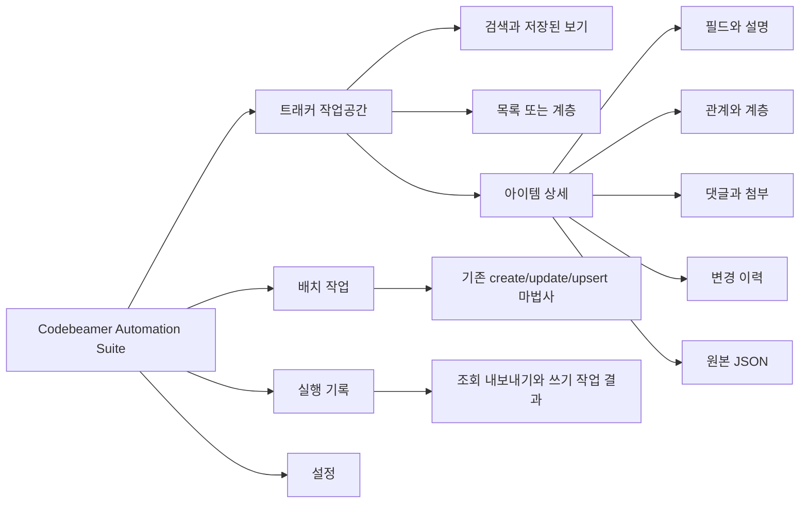

# 트래커 작업공간 GUI 기획 및 스토리보드

## 문서 상태

- 상태: 구현 전 기획안
- 기획 브랜치: `feature/tracker-workspace-gui-plan`
- 기준 브랜치: `main` (`7a840d8`)
- 작성일: 2026-08-02
- 구현 여부: 이 문서에 적힌 새 화면과 기능은 아직 구현되지 않았습니다.

## 1. 결론

현재의 9단계 업로드 마법사에 조회 화면을 한 단계 더 끼우는 방식은 권장하지 않습니다.
조회는 사용자가 같은 화면에 머물면서 검색, 목록 비교, 상세 확인을 반복하는 작업이고,
업로드는 순서대로 설정을 확정하는 작업이어서 탐색 구조가 서로 다릅니다.

새 GUI는 다음 구조를 목표로 합니다.

1. 앱 최상위에 `트래커 작업공간`, `배치 작업`, `실행 기록`, `설정`을 둡니다.
2. 기존 생성·수정·업서트 마법사는 `배치 작업` 안에서 그대로 보존합니다.
3. 첫 구현은 조회 전용 세로 슬라이스로 제한합니다.
4. 단건 생성·편집, 상태 전환, 댓글·첨부·관계 편집은 조회 기반이 안정된 뒤 단계적으로 추가합니다.
5. 트래커 자체의 필드·권한·워크플로우 구성 관리는 초기 범위에서 제외합니다.

`Codebeamer 트래커의 대부분의 기능`을 한 번에 구현 목표로 삼으면 완료 기준이 불명확하고
권한, 워크플로우, 서버 버전 차이까지 한 PR에 섞입니다. 제품 구조는 장기 확장을 허용하되,
첫 완료 기준은 `검색 -> 목록 -> 상세 조회`로 명확히 고정합니다.

## 2. 현재 저장소 기준선

| 영역 | 현재 확인된 상태 | 새 GUI에 주는 영향 |
| --- | --- | --- |
| GUI 탐색 | 설정부터 결과까지 9단계 업로드 마법사 | 조회는 별도 작업공간으로 분리해야 함 |
| 프로젝트·트래커 | 온라인 목록 조회 및 테스트 모드 snapshot 지원 | 전역 컨텍스트 선택기로 재사용 가능 |
| 아이템 목록 | `get_tracker_items()` helper 존재 | 단일 응답의 참조 목록만으로는 페이지형 브라우저에 부족함 |
| 아이템 검색 | CbQL 기반 `search_items()`와 이름 lookup helper 존재 | 페이지·정렬·필터 상태 모델을 추가하면 조회 기반으로 재사용 가능 |
| 아이템 상세 | `get_item()` helper 존재 | 상세 패널의 원본 데이터 소스로 재사용 가능 |
| 쓰기 | Excel 기반 create/update/upsert, `PUT /v3/items/{id}` helper 존재 | 조회 MVP와 분리하고 단건 편집 안전성을 먼저 검증해야 함 |
| 오프라인 데이터 | schema/config와 업로드용 Excel sample만 존재 | 조회용 익명화 item fixture가 새로 필요함 |
| GUI 실행 | 긴 작업은 `BackgroundTask`로 처리 | 조회·상세 호출에도 같은 비동기 원칙 적용 |

현재 `CodebeamerClient.update_item()`은 전체 아이템 리소스를 갱신하는 경로를 사용합니다.
공식 API 문서상 전체 `PUT /v3/items/{itemId}`는 제공한 상태로 전체 리소스를 교체하므로,
단건 편집 GUI에서 일부 필드만 보낸다면 다른 값이 지워질 위험이 있습니다.
따라서 편집 기능은 field-level update, 상태 전환, 권한, 버전 충돌 정책을 확인하기 전에는
화면에 활성 기능으로 노출하지 않습니다.

## 3. 제품 범위

### 3.1 단계별 범위

| 단계 | 사용자 가치 | 포함 기능 | 포함하지 않는 기능 |
| --- | --- | --- | --- |
| Phase 1 | 필요한 아이템을 빠르게 찾고 확인 | 프로젝트·트래커 선택, 간편 필터, CbQL, 페이지 목록, 상세 조회, 원본 JSON | 모든 쓰기 |
| Phase 2 | 아이템 맥락과 변경 근거 확인 | 계층, 관계, 댓글, 첨부 메타데이터, 변경 이력 조회 | 댓글·첨부·관계 변경 |
| Phase 3 | 안전한 단건 작업 | schema 기반 생성·편집, field-level update, 상태 전환, 충돌 감지 | 대량 파괴 작업 |
| Phase 4 | 협업과 대량 작업 | 댓글·첨부, 관계 변경, 조회 결과 내보내기, 선택 항목 배치 작업 연결 | 트래커 관리자 설정 |

### 3.2 초기 제외 범위

- 트래커 생성·삭제와 템플릿 상속 관리
- 필드, 권한, 워크플로우, 알림 규칙 구성
- Review Hub와 merge request를 GUI 안에서 재구현
- 아이템 삭제, 트래커 간 이동·복사
- Codebeamer 웹 UI 전체를 복제하는 기능

위 기능은 상위 메뉴를 다시 바꾸지 않고도 나중에 추가할 수 있어야 하지만,
초기 조회 기능의 완료 조건에는 넣지 않습니다.

## 4. 목표 정보 구조



## 5. 공통 앱 셸

### 5.1 일반 창 기준

```text
┌──────────────────────────────────────────────────────────────────────────────┐
│ Codebeamer Automation Suite        온라인 · 연결됨      사용자      설정    │
├──────────────┬───────────────────────────────────────────────────────────────┤
│ 트래커       │ 프로젝트 [선택]  트래커 [선택]     [새로고침]                │
│ 작업공간     ├───────────────────────────────────────────────────────────────┤
│              │ 현재 작업 화면                                                │
│ 배치 작업    │                                                               │
│              │ 데이터 테이블·미리보기·상세 영역이 우선 확장                 │
│ 실행 기록    │                                                               │
│              │                                                               │
│ 설정         │                                               상태 / 주요 동작 │
└──────────────┴───────────────────────────────────────────────────────────────┘
```

### 5.2 셸 원칙

- 저장된 연결 설정이 유효하면 매 실행마다 설정 마법사부터 시작하지 않습니다.
- 프로젝트와 트래커는 작업공간 상단의 공통 컨텍스트로 유지합니다.
- 프로젝트가 바뀌면 트래커, 검색 조건, 목록, 상세 선택을 순서대로 초기화합니다.
- 트래커가 바뀌면 schema와 필드 후보를 다시 읽고 이전 트래커의 필터를 적용하지 않습니다.
- 검색어나 필터를 입력할 때마다 서버를 호출하지 않고 `조회` 버튼을 명시적으로 누릅니다.
- 전체 화면에서는 목록과 상세가 함께 확장되고, 라벨이나 설명 영역은 고정적으로 커지지 않습니다.
- `kefico`, `igloo` 테마와 테스트 모드 표시는 기존 동작을 유지합니다.

## 6. 핵심 스토리보드

### S00. 시작과 연결 확인

| 항목 | 내용 |
| --- | --- |
| 진입 | 앱 실행 |
| 기본 화면 | 마지막 연결 설정을 확인한 뒤 트래커 작업공간 표시 |
| 성공 | 연결 상태와 마지막 프로젝트·트래커를 표시하되 자동 검색은 하지 않음 |
| 실패 | 작업공간은 유지하고 상단에 재연결 동작과 오류 요약 표시 |
| 테스트 모드 | 조회 fixture가 있을 때만 조회 메뉴 활성화 |

### S01. 프로젝트와 트래커 선택

| 항목 | 내용 |
| --- | --- |
| 진입 | 상단 컨텍스트에서 프로젝트 선택 |
| 주요 동작 | 트래커 목록 불러오기, 트래커 선택, schema 불러오기 |
| 로딩 | 컨텍스트 영역만 busy 처리하고 기존 목록은 `이전 결과`로 표시 |
| 빈 결과 | 접근 가능한 트래커가 없다는 설명과 새로고침 동작 표시 |
| 권한 오류 | 인증 실패와 조회 권한 부족을 다른 메시지로 구분 |

### S02. 아이템 조회

```text
┌──────────────────────────────────────────────────────────────────────────────┐
│ 프로젝트 [Vehicle]  트래커 [Requirements]                  [새로고침]       │
├──────────────────────────────────────────────────────────────────────────────┤
│ 빠른 검색 [요약 또는 ID________________]  상태 [전체]  담당자 [전체] [조회] │
│ [고급 조건 펼치기]  [CbQL]                           결과 1-100 / 총 2,431건 │
├───────────────────────────────────────────────┬──────────────────────────────┤
│ □ ID      Summary             Status  Assignee│ 선택한 아이템 없음           │
│ □ 1042    Brake requirement   Open    user-a  │ 행을 선택하면 상세를 표시    │
│ □ 1041    Steering behavior   Review  user-b  │                              │
│                                               │                              │
│                                               │                              │
├───────────────────────────────────────────────┴──────────────────────────────┤
│ [이전]  1 / 25  [다음]                [선택 항목 배치 작업] [결과 내보내기] │
└──────────────────────────────────────────────────────────────────────────────┘
```

동작 원칙:

- 기본 필터는 ID/요약, 상태, 담당자처럼 schema와 무관하게 이해하기 쉬운 항목으로 시작합니다.
- `고급 조건`은 현재 트래커 schema에서 검색 가능한 필드만 보여줍니다.
- `CbQL`은 전문가용 별도 탭으로 제공하고 간편 필터와 동시에 편집하지 않습니다.
- 기본 page size는 100으로 하되 서버 제한과 응답 시간을 확인해 조정합니다.
- 목록 정렬은 서버 정렬을 우선하고, 현재 페이지만 정렬하는 오해를 만들지 않습니다.
- 조회 결과가 많아도 모든 상세 payload를 선조회하지 않습니다.
- `선택 항목 배치 작업`과 `결과 내보내기`는 Phase 1에서 비활성 또는 미표시합니다.

### S03. 아이템 상세 조회

```text
┌──────────────────────────────────────────────────────────────────────────────┐
│ 1042 · Brake requirement                  Open      [웹에서 열기] [편집]    │
├──────────────────────────────────────────────────────────────────────────────┤
│ [상세] [관계·계층] [댓글·첨부] [변경 이력] [원본 JSON]                     │
├──────────────────────────────────────────────────────────────────────────────┤
│ Summary        Brake requirement                                             │
│ Description    ...                                                           │
│ Status         Open                     Priority       High                   │
│ Assigned to    user-a                   Modified       2026-08-01 14:20       │
│                                                                              │
│ Custom fields                                                               │
│ Requirement type  Functional            Safety class  ASIL-B                 │
└──────────────────────────────────────────────────────────────────────────────┘
```

동작 원칙:

- 행을 선택할 때 상세를 별도 비동기 요청으로 불러옵니다.
- 이전 요청이 끝나기 전에 다른 행을 선택하면 늦게 온 응답이 새 선택을 덮지 않게 합니다.
- builtin field와 custom field를 구분하되 사용자에게 API 모델 이름을 강요하지 않습니다.
- 값이 없는 필드는 숨김과 `값 없음` 중 schema 중요도에 따라 일관되게 처리합니다.
- 알 수 없는 field/value model은 원본 JSON에 보존하고 지원되는 것처럼 편집하지 않습니다.
- `편집`은 Phase 3 전까지 표시하지 않거나 `조회 전용`으로 명확히 비활성화합니다.

### S04. 관계와 계층 조회

| 탭 | 표시 내용 | Phase 2 동작 |
| --- | --- | --- |
| 관계·계층 | 부모, 자식, downstream/upstream reference, association | 대상 아이템 상세로 이동 |
| 댓글·첨부 | 댓글 스레드, 첨부 메타데이터 | 읽기와 다운로드 가능 여부를 서버별 검증 |
| 변경 이력 | 버전, 변경자, 변경 시각, 변경 필드 | 버전 간 차이 표시 |
| 원본 JSON | 서버 응답과 정규화 결과 | 복사, 민감값 마스킹 |

계층은 전체 트래커를 한 번에 읽지 않습니다. 현재 아이템 주변을 지연 로딩하고,
트리 노드를 펼칠 때 자식 목록을 요청합니다.

### S05. 단건 생성과 편집

```text
┌──────────────────────────────────────────────────────────────────────────────┐
│ 아이템 편집 · 1042                  서버 버전 7        [변경 취소] [검증]   │
├──────────────────────────────────────────────────────────────────────────────┤
│ 필수 필드                                                                   │
│ Summary *      [Brake requirement________________________________________]   │
│ Status         [Open]   상태는 전환 동작에서 변경                            │
│                                                                              │
│ 일반 필드                                                                   │
│ Priority       [High]                 Assigned to [user-a]                   │
│ Description    [.........................................................]   │
│                                                                              │
│ 미지원 필드 1개 · 원본 값은 유지되며 이 화면에서는 수정할 수 없습니다.      │
├──────────────────────────────────────────────────────────────────────────────┤
│ 변경 3개 · 충돌 없음                                  [미리보기] [저장]    │
└──────────────────────────────────────────────────────────────────────────────┘
```

안전 조건:

- schema와 현재 상태의 field permission을 기준으로 입력 가능 여부를 결정합니다.
- 일부 필드 변경은 field-level update를 사용하고 전체 item `PUT`을 기본값으로 사용하지 않습니다.
- status는 일반 option 변경이 아니라 가능한 transition 목록과 필수 입력을 거칩니다.
- 상세를 열었던 시점의 version과 저장 직전 version이 다르면 자동 덮어쓰지 않습니다.
- 미지원 field/value model이 있어도 원본 값이 소실되지 않는다는 검증 전에는 저장을 막습니다.
- 저장 전 변경 필드와 before/after를 보여줍니다.

### S06. 상태 전환

| 순서 | 화면 동작 |
| --- | --- |
| 1 | 현재 상태에서 가능한 transition 목록 조회 |
| 2 | transition 선택 후 추가 필수 필드와 권한 표시 |
| 3 | 변경 미리보기와 사용자 확인 |
| 4 | transition 실행 |
| 5 | 아이템 상세 재조회 후 결과 표시 |

Status option ID를 payload에 직접 넣는 방식은 현재 지원으로 간주하지 않습니다.
대상 Codebeamer 버전의 Swagger와 실제 workflow 동작을 확인한 뒤 구현합니다.

### S07. 기존 배치 작업

기존 마법사는 다음과 같이 새 셸 안에서 보존합니다.


- 기존 단계별 검증과 payload cache를 유지합니다.
- 조회 화면에서 선택한 항목을 바로 수정하는 기능과 Excel 배치 update를 같은 동작처럼 보이게 하지 않습니다.
- 조회 결과를 배치 입력으로 연결하는 기능은 별도 변환·검증 단계를 거칩니다.

### S08. 실행 기록

| 항목 | 내용 |
| --- | --- |
| 대상 | create/update/upsert, 향후 export와 대량 작업 |
| 요약 | 시작·종료 시각, 대상 tracker, 모드, 성공·실패·미해결 수 |
| 상세 | 로그, 실패 응답, 결과 파일 경로 |
| 보안 | 비밀번호, 토큰, 인증 header, 실제 서버 응답의 민감 필드 저장 금지 |

단순 조회 이력은 기본적으로 영구 저장하지 않습니다. 사용자가 실행한 내보내기나 쓰기 작업만
감사 가능한 실행 단위로 기록합니다.

## 7. 화면 크기와 데이터 영역 정책

| 창 너비 | 목록·상세 배치 | 원칙 |
| --- | --- | --- |
| 1440px 이상 | 목록과 상세 60:40 분할 | 테이블 행과 상세 필드가 함께 확장 |
| 1160px 기본 | 목록 우선 65:35, 상세 접기 가능 | 필터는 두 줄까지 wrap |
| 860px 최소 | 목록과 상세를 한 번에 하나씩 표시 | 아이템 선택 후 상세 화면으로 이동, 뒤로 가기 제공 |

- 세로 공간은 목록, 상세, 로그, 결과 테이블이 우선 차지합니다.
- 필터와 설명이 데이터 영역을 밀어내지 않도록 고급 조건은 접을 수 있게 합니다.
- 필수 컬럼을 고정 폭으로 과도하게 제한하지 않고 내용과 창 크기에 맞춰 조정합니다.
- 테이블의 열 선택 상태는 `프로젝트 + 트래커` 단위로 로컬 저장할 수 있습니다.

## 8. 상태와 오류 처리

| 상태 | 사용자 표시 | 허용 동작 |
| --- | --- | --- |
| 초기 | 트래커 선택 안내 | 컨텍스트 선택 |
| 조회 중 | 기존 결과 위에 비차단 로딩 상태 | 요청 취소 또는 새 조건 대기 |
| 결과 있음 | total, page, query 요약 | 행 선택, 페이지 이동 |
| 결과 없음 | 적용된 조건과 빈 결과 설명 | 조건 수정, 초기화 |
| 인증 실패 | 연결 정보 확인 필요 | 설정으로 이동, 재연결 |
| 권한 없음 | 접근 불가 대상과 작업 종류 표시 | 다른 tracker 선택 |
| 429/rate limit | 재시도 횟수와 다음 시도 표시 | 자동 재시도 또는 중단 |
| 일부 상세 실패 | 목록은 유지, 상세 패널에 오류 | 상세 재시도 |
| version 충돌 | 서버 변경 사실과 diff 표시 | 재조회, 변경 재적용, 취소 |
| 미지원 모델 | 읽기 값과 모델 이름 표시 | 원본 확인, 편집 차단 |

## 9. API와 데이터 계약

아래 표는 구현 후보이지 현재 지원 완료 목록이 아닙니다.
실제 서버의 `/v3/swagger/editor.spr`에서 endpoint, permission, request/response 모델을 다시 확인해야 합니다.

| 사용자 기능 | 현재 저장소 | 후보 API 또는 추가 조사 |
| --- | --- | --- |
| 트래커 아이템 목록 | 참조 목록 helper | `GET /v3/trackers/{trackerId}/items`, pagination 정규화 |
| 조건 검색 | CbQL GET helper | `GET/POST /v3/items/query`, 정렬·페이지·baseline 정책 |
| 상세 | 단건 helper | `GET /v3/items/{itemId}`, field model 정규화 |
| schema | helper 존재 | `GET /v3/trackers/{trackerId}/schema` 또는 fields endpoint 차이 확인 |
| 계층 | tracker children helper 일부 | item children, tracker outline endpoint의 버전별 지원 확인 |
| 관계 | 없음 | item relations endpoint와 reference/association 구분 |
| 댓글·첨부 | 없음 | comments/attachments endpoint와 다운로드 정책 |
| 변경 이력 | 없음 | item history endpoint와 revision 모델 |
| 단건 일부 필드 수정 | 없음 | `PUT /v3/items/{itemId}/fields` 우선 검토 |
| 동시 편집 | 없음 | version 비교 및 soft lock endpoint 지원 확인 |
| 상태 전환 | 미구현 TODO | 현재 상태의 transition 조회·실행 방식 확인 |

조회 모델은 최소한 아래 정보를 명시적으로 분리합니다.

- `TrackerQuery`: tracker, 간편 필터 또는 CbQL, page, page size, sort, baseline
- `TrackerItemSummary`: 목록에 필요한 ID, summary, status, assignee, modified time
- `TrackerItemDetail`: builtin fields, custom fields, raw payload, version
- `PageResult`: items, page, page size, total, server query metadata
- `LoadState`: idle, loading, loaded, empty, error, stale

서버 원본 dict를 Qt widget이 직접 탐색하게 하지 않고, 서비스 경계에서 화면 모델로 정규화합니다.
다만 초기 단계에 범용 repository/factory 계층을 추가하지 않고 실제 조회 흐름에 필요한 모델만 둡니다.

## 10. 구현 구조 제안

첫 세로 슬라이스는 다음 정도의 명시적인 구조로 시작합니다.

```text
src/gui/
├── page_tracker_workspace.py   # 검색, 목록, 상세 레이아웃
├── tracker_query_service.py    # query/detail 요청과 응답 정규화
├── tracker_query_models.py     # query, summary, detail, page 상태
└── window_tracker.py           # 선택·페이지·상세 요청 오케스트레이션
```

재사용 대상:

- `CodebeamerClient`의 프로젝트, 트래커, schema, query, item helper
- 기존 `BackgroundTask`와 busy/error 표시
- `GuiSettingsStore`의 연결·테마·창 상태
- 기존 테이블 크기와 responsive layout helper

초기에는 별도 플러그인 시스템, 범용 command bus, 화면 factory를 만들지 않습니다.
조회와 상세 흐름이 안정된 후 중복이 실제로 확인될 때만 공통화를 검토합니다.

## 11. 브랜치와 PR 분할

현재 생성한 기획 브랜치는 문서만 포함합니다.

| 순서 | 브랜치 | 목표 | 선행 조건 |
| --- | --- | --- | --- |
| 0 | `feature/tracker-workspace-gui-plan` | 스토리보드와 범위 합의 | 없음 |
| 1 | `feature/tracker-query-service` | pagination, query/detail 모델, offline fixture, 서비스 테스트 | 기획 승인 |
| 2 | `feature/tracker-item-browser` | 앱 셸, 컨텍스트 선택, 필터, 목록, 상세 조회 | query service merge |
| 3 | `feature/tracker-item-context` | 계층, 관계, 댓글·첨부, 이력 읽기 | browser merge |
| 4 | `feature/tracker-item-editor` | schema 기반 단건 생성·편집과 충돌 처리 | live API 계약 검증 |
| 5 | `feature/tracker-item-transition` | 가능한 transition 조회·실행 | workflow smoke test |
| 6 | `feature/tracker-item-collaboration` | 댓글·첨부·관계 쓰기 | 권한·파일 보안 정책 확정 |
| 7 | `feature/tracker-bulk-actions` | 내보내기와 선택 항목 배치 연결 | 조회·쓰기 안정화 |
| 8 | `refactor/gui-workspace-boundaries` | 구현 후 확인된 셸·서비스 경계 정리 | 기능 PR merge 후 필요 시 |

각 구현 브랜치는 최신 `main`에서 만들고, 앞 단계가 merge된 뒤 다음 단계를 시작합니다.
장기간 유지되는 하나의 거대 브랜치나 기능과 구조 리팩터링이 섞인 PR은 만들지 않습니다.

## 12. Phase 1 완료 조건

- 온라인 모드에서 프로젝트와 트래커를 선택할 수 있습니다.
- 사용자가 `조회`를 눌러야만 아이템 검색 요청이 실행됩니다.
- CbQL을 직접 입력하지 않아도 ID/요약 기반 검색을 할 수 있습니다.
- 전문가용 CbQL을 별도 모드에서 실행할 수 있습니다.
- 현재 page, page size, total이 서버 결과와 일치합니다.
- 다음·이전 페이지에서 중복이나 누락 없이 결과가 바뀝니다.
- 행 선택 시 상세 정보와 custom field를 읽기 전용으로 표시합니다.
- 상세 요청이 늦게 도착해도 현재 선택을 덮어쓰지 않습니다.
- 인증 실패, 권한 없음, 429, 빈 결과, 상세 일부 실패를 구분합니다.
- 테스트 모드에서 익명화 fixture로 검색·목록·상세 흐름을 재현합니다.
- 조회용 fixture와 로그에 실제 서버 정보, 사용자 식별자, 자격증명을 넣지 않습니다.
- `860x620`, `1160x780`, 최대화 환경과 `kefico`, `igloo` 테마를 검증합니다.
- 서비스 단위 테스트, 페이지 상태 테스트, GUI smoke test를 추가하고 실행합니다.
- 기존 create/update/upsert 회귀 테스트가 통과합니다.

## 13. 구현 전 확정할 결정

| 결정 | 권장안 | 이유 |
| --- | --- | --- |
| 제품 범위 | tracker item 작업 중심, tracker 관리자 기능 제외 | 권한·구성 관리까지 포함하면 별도 제품 규모가 됨 |
| 첫 릴리스 | 읽기 전용 검색·목록·상세 | 가장 작은 사용자 가치 단위이며 쓰기 데이터 손실 위험이 없음 |
| 검색 UX | 간편 필터와 전문가용 CbQL 분리 | 초보자와 기존 CbQL 사용자를 함께 지원 |
| 상세 배치 | 넓은 창 split view, 좁은 창 단일 화면 전환 | 데이터 가시성과 최소 창 대응을 동시에 만족 |
| 저장된 보기 | 초기에는 로컬 preset | Codebeamer report 기능과의 권한·호환성 결합을 늦춤 |
| 내보내기 | Phase 2 이후 XLSX/CSV | 조회 정확성과 pagination을 먼저 검증해야 전체 결과를 신뢰할 수 있음 |
| 파괴 작업 | 삭제·이동·복사는 별도 후속 기획 | 복구, 권한, 타입 변환, 확인 UX가 필요함 |

위 권장안이 승인되면 첫 구현 브랜치는 `feature/tracker-query-service`입니다.

## 14. 주요 리스크와 대응

| 리스크 | 영향 | 대응 |
| --- | --- | --- |
| 범위 팽창 | 완료되지 않는 대형 PR | read-only vertical slice와 단계별 브랜치 유지 |
| 서버 버전 차이 | endpoint나 모델 불일치 | 대상 서버 Swagger 확인과 capability matrix 작성 |
| 전체 item PUT | 미전송 필드 소실 | field-level update 우선, before/after 검증 |
| workflow 권한 | status 변경 실패 또는 잘못된 전환 | 가능한 transition과 field permission을 실행 시점에 조회 |
| 대형 tracker | UI 멈춤, 과도한 요청 | 서버 pagination, 명시적 조회, 상세 지연 로딩 |
| 늦은 응답 경쟁 | 다른 아이템 상세가 잘못 표시 | request token과 현재 selection 비교 |
| rate limit | 연속 조회 실패 | 읽기 요청 재시도 정책과 사용자 중단 제공 |
| 오프라인 불일치 | 테스트 통과 후 live 실패 | 익명 fixture 테스트와 별도 live smoke test 구분 |
| 민감 데이터 노출 | 로그·fixture·preset 유출 | 인증값 미기록, raw JSON 마스킹, 익명 fixture 감사 |

## 15. 참고 자료

- [PTC Codebeamer Tracker Item Operations](https://support.ptc.com/help/codebeamer/r3.2/en/codebeamer/developers_guide/swagger/11375769.html)
- [PTC Codebeamer Tracker Item Model Structure](https://support.ptc.com/help/codebeamer/r3.1/en/codebeamer/developers_guide/swagger/dg_tracker_item_model_structure.html)
- [PTC Codebeamer Modifying Tracker Items](https://support.ptc.com/help/codebeamer/r3.0/en/codebeamer/developers_guide/swagger/dg_modifying_a_tracker_item.html)
- [PTC Codebeamer Tracker Item Lock Operations](https://support.ptc.com/help/codebeamer/r3.2/en/codebeamer/developers_guide/swagger/dg_tracker_item_lock_operations.html)
- [현재 GUI 사용 가이드](./gui-plan.md)
- [현재 아키텍처](./architecture.md)
