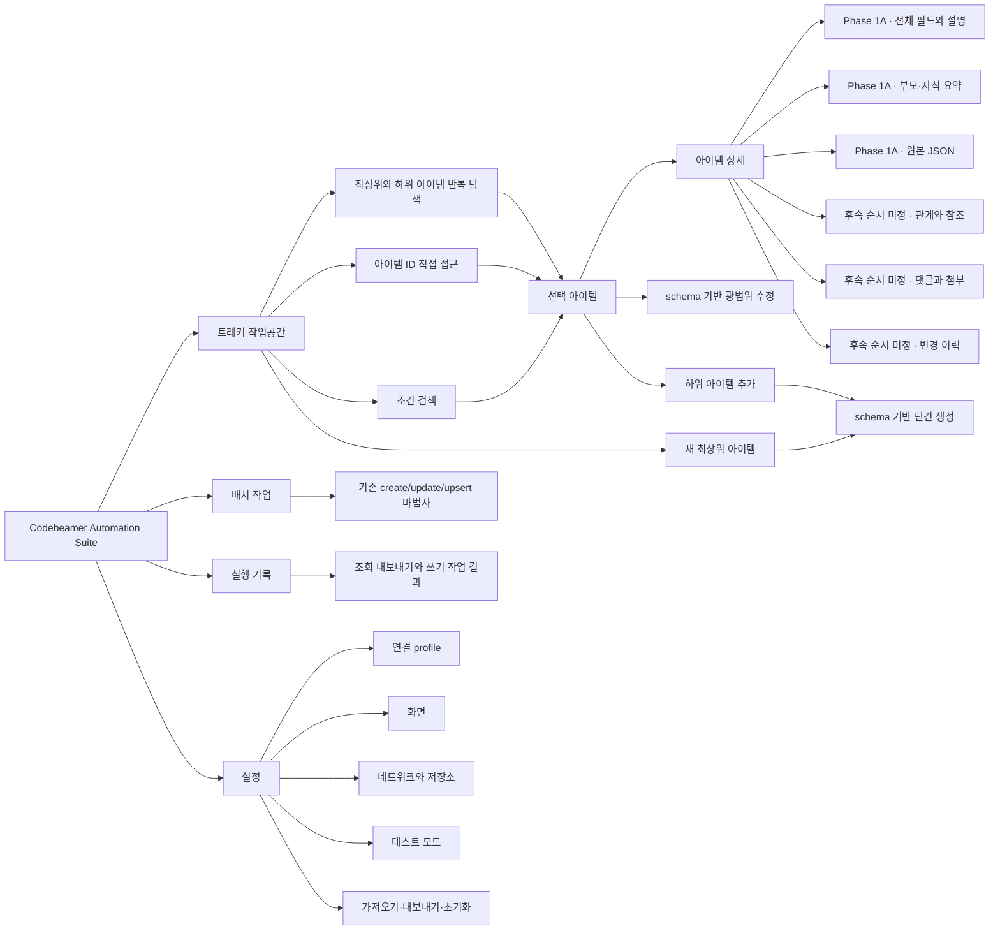

# 트래커 작업공간 GUI 기획 및 스토리보드

## 문서 상태

- 상태: 구현 전 기획 확정안
- 기획 브랜치: `feature/tracker-workspace-gui-plan`
- 기준 브랜치: `main` (`7a840d8`)
- 작성일: 2026-08-02
- 최종 수정일: 2026-08-03
- 구현 여부: 이 문서에 적힌 새 화면과 기능은 아직 구현되지 않았습니다.

## 1. 결론

현재의 9단계 업로드 마법사에 조회 화면을 한 단계 더 끼우는 방식은 권장하지 않습니다.
조회는 사용자가 같은 화면에 머물면서 검색, 목록 비교, 상세 확인을 반복하는 작업이고,
업로드는 순서대로 설정을 확정하는 작업이어서 탐색 구조가 서로 다릅니다.

새 GUI는 다음 구조를 목표로 합니다.

1. 앱 최상위에 `트래커 작업공간`, `배치 작업`, `실행 기록`, `설정`을 둡니다.
2. 기존 생성·수정·업서트 마법사는 `배치 작업` 안에서 그대로 보존합니다.
3. 첫 구현은 계층 탐색, 선택 아이템 상세 조회, ID 직접 접근을 하나의 세로 슬라이스로 묶습니다.
4. 선택 아이템은 schema 기반 광범위 편집으로 이어지게 하되, 필드 유형별 검증이 끝난 순서대로 활성화합니다.
5. 트래커 자체의 필드·권한·워크플로우 구성 관리는 초기 범위에서 제외합니다.

`Codebeamer 트래커의 대부분의 기능`을 한 번에 구현 목표로 삼으면 완료 기준이 불명확하고
권한, 워크플로우, 서버 버전 차이까지 한 PR에 섞입니다. 제품 구조는 장기 확장을 허용하되,
첫 완료 기준은 `프로젝트·트래커 선택 -> 최상위 아이템 -> 하위 아이템 반복 -> 상세 조회`와
`아이템 ID -> 해당 아이템 바로 열기`로 명확히 고정합니다.

### 1.1 확정된 1차 사용 시나리오

| 구분 | 결정 |
| --- | --- |
| 기본 사용 방식 | 트래커 탐색형과 단건 빠른 작업형을 결합 |
| 기본 진입 | 프로젝트와 트래커를 선택한 뒤 최상위 아이템 조회 |
| 계층 이동 | 선택한 아이템의 하위 아이템을 조회하고 같은 방식으로 반복 |
| 계층 표현 | Codebeamer 웹 사용자에게 익숙한 확장형 트리 |
| 선택 아이템 | 상세 조회를 기본으로 하고 schema 기반 광범위 수정으로 이어지게 구성 |
| 편집 화면 | 트리·상세와 분리된 전체 화면 편집기 |
| 저장 방식 | 전체 변경을 검증·미리보기한 뒤 한 번의 사용자 동작으로 저장 |
| 빠른 접근 | 아이템 ID를 조회하고 해당 프로젝트·트래커와 트리 위치로 자동 전환 |
| 조건 검색 | `간편`, `상세 조건`, `CbQL` 세 모드를 분리하고 상세 조건은 별도 큰 창으로 제공 |
| 조건 논리식 | 한 묶음 안의 모든 조건을 만족하거나 여러 묶음 중 하나 이상을 만족하는 1단계 조합 |
| 상세 조회 1차 범위 | 전체 필드, 설명, custom field, 부모·자식 요약, 원본 JSON |
| 설정 관리 | 업로드 단계와 분리된 최상위 전용 설정 페이지 |
| 후속 검토 | Excel 데이터와 서버 아이템을 대조하는 흐름 |

관계·참조, 댓글·첨부, 변경 이력은 첫 릴리스에 한꺼번에 포함하지 않고 후속 읽기 기능으로
단계적으로 추가합니다. 광범위 편집 이후에는 상태 전환, 단건 아이템 생성을 순서대로 구현하고
맥락 조회 기능의 구현 순서는 Phase 3 완료 시 다시 검토합니다. 현재 기획에 필요한 사용자 선택은
모두 확정됐으며, 구현 중 서버별 API 계약이 확인되지 않으면 지원을 가장하지 않고 기능을 차단합니다.

## 2. 현재 저장소 기준선

| 영역 | 현재 확인된 상태 | 새 GUI에 주는 영향 |
| --- | --- | --- |
| GUI 탐색 | 설정부터 결과까지 9단계 업로드 마법사 | 조회는 별도 작업공간으로 분리해야 함 |
| 프로젝트·트래커 | 온라인 목록 조회 및 테스트 모드 snapshot 지원 | 전역 컨텍스트 선택기로 재사용 가능 |
| 아이템 목록 | `get_tracker_items()` helper 존재 | 단일 응답의 참조 목록만으로는 페이지형 브라우저에 부족함 |
| 아이템 검색 | CbQL 기반 `search_items()`와 이름 lookup helper 존재 | 페이지·정렬·필터 상태 모델을 추가하면 조회 기반으로 재사용 가능 |
| 아이템 상세 | `get_item()` helper 존재 | 상세 패널의 원본 데이터 소스로 재사용 가능 |
| 쓰기 | Excel 기반 create/update/upsert, `PUT /v3/items/{id}` helper 존재 | 조회 MVP와 분리하고 단건 편집 안전성을 먼저 검증해야 함 |
| 설정 관리 | 업로드 마법사 첫 단계에 연결·테마·offline·Excel·재시도 설정이 함께 있고 단일 설정 파일과 단일 workflow preset 저장 | 전역 설정과 배치 작업 설정을 분리한 전용 관리 페이지가 필요함 |
| 오프라인 데이터 | schema/config와 업로드용 Excel sample만 존재 | 조회용 익명화 item fixture가 새로 필요함 |
| GUI 실행 | 긴 작업은 `BackgroundTask`로 처리 | 조회·상세 호출에도 같은 비동기 원칙 적용 |

현재 `CodebeamerClient.update_item()`은 전체 아이템 리소스를 갱신하는 경로를 사용합니다.
공식 API 문서상 전체 `PUT /v3/items/{itemId}`는 제공한 상태로 전체 리소스를 교체하므로,
단건 편집 GUI에서 일부 필드만 보낸다면 다른 값이 지워질 위험이 있습니다.
따라서 편집 기능은 field-level update, 상태 전환, 권한, 버전 충돌 정책을 확인하기 전에는
화면에 활성 기능으로 노출하지 않습니다.

## 3. 제품 범위

### 3.1 단계별 범위

| 단계 | 사용자 가치 | 포함 기능 | 포함하지 않는 기능 |
| --- | --- | --- | --- |
| Foundation 1 | 조회·배치·기록·설정을 한 앱에서 이동 | 최상위 앱 셸, route, 기존 배치 마법사 container | 트래커 조회 구현 |
| Foundation 2 | 연결과 앱 설정을 작업 흐름과 분리해 관리 | 전용 설정 센터, 다중 profile, credential 선택, 테스트 mode, legacy migration | 배치 preset 편집 |
| Phase 1A | 필요한 아이템을 계층 또는 ID로 빠르게 찾고 확인 | 프로젝트·트래커 선택, 최상위·하위 반복 탐색, ID 직접 접근, 전체 필드·설명·custom field 상세, 부모·자식 요약, 원본 JSON | 모든 쓰기, 관계·댓글·첨부·이력 상세 조회 |
| Phase 1B-1 | 광범위 편집 기반과 기본 필드 | schema 기반 편집기, scalar, static choice, 충돌 감지 | reference, TableField, 상태 전환 |
| Phase 1B-2 | reference와 다중값 편집 | user/member/tracker item reference, 다중값 | TableField와 상태 전환 |
| Phase 1B-3 | TableField 편집 | 실제 다중 row 구조를 유지하는 전용 grid 편집 | 상태 전환 |
| Phase 2 | 워크플로우에 맞게 상태 변경 | 가능한 transition 조회, 필수 입력 검증, 상태 전환 | 상태 option 직접 수정, 임의 상태 건너뛰기 |
| Phase 3 | 작업공간에서 아이템 한 건 생성 | schema 기반 단건 신규 생성 | 대량 생성, 대량 파괴 작업 |
| 후속 순서 미정 | 아이템 맥락과 변경 근거 확인 | 관계, 댓글, 첨부 메타데이터, 변경 이력 조회 | 댓글·첨부·관계 변경 |
| 이후 | 협업과 대량 작업 | 댓글·첨부, 관계 변경, 조회 결과 내보내기, 선택 항목 배치 작업 연결 | 트래커 관리자 설정 |
| 마지막 후속 | 잘못 만든 아이템을 안전하게 제거 | 권한 확인, 영향 요약, 명시적 확인을 거친 단건 삭제 | 이동·복사, 목록·검색 결과의 대량 삭제 |
| 후속 검토 | Excel과 서버 데이터 비교 | 신규·변경·누락 비교, update 전 검증 | Phase 1 완료 조건에 포함하지 않음 |

### 3.2 초기 제외 범위

- 트래커 생성·삭제와 템플릿 상속 관리
- 필드, 권한, 워크플로우, 알림 규칙 구성
- Review Hub와 merge request를 GUI 안에서 재구현
- 아이템 이동·복사와 대량 삭제
- Codebeamer 웹 UI 전체를 복제하는 기능

단건 아이템 삭제만 마지막 후속 기능으로 별도 추가합니다. 나머지 기능은 상위 메뉴를 다시
바꾸지 않고도 나중에 추가할 수 있어야 하지만 초기 조회 기능의 완료 조건에는 넣지 않습니다.

## 4. 목표 정보 구조



## 5. 공통 앱 셸

### 5.1 일반 창 기준

```text
┌──────────────────────────────────────────────────────────────────────────────┐
│ Codebeamer Automation Suite        온라인 · 연결됨      사용자      설정    │
├──────────────┬───────────────────────────────────────────────────────────────┤
│ 트래커       │ 프로젝트 [선택]  트래커 [선택]   ID [________] [바로 열기]  │
│ 작업공간     ├───────────────────────────────────────────────────────────────┤
│              │ 현재 작업 화면                                                │
│ 배치 작업    │                                                               │
│              │ 데이터 테이블·미리보기·상세 영역이 우선 확장                 │
│ 실행 기록    │                                                               │
│              │                                                               │
│ 설정         │                                               상태 / 주요 동작 │
└──────────────┴───────────────────────────────────────────────────────────────┘
```

### 5.2 셸 원칙

- 저장된 연결 설정이 유효하면 매 실행마다 설정 마법사부터 시작하지 않습니다.
- 프로젝트와 트래커는 작업공간 상단의 공통 컨텍스트로 유지합니다.
- 아이템 ID 직접 접근은 현재 계층 위치와 별개로 항상 사용할 수 있게 하고, 성공 시 대상 컨텍스트로 전환합니다.
- 프로젝트가 바뀌면 트래커, 검색 조건, 목록, 상세 선택을 순서대로 초기화합니다.
- 트래커가 바뀌면 schema와 필드 후보를 다시 읽고 이전 트래커의 필터를 적용하지 않습니다.
- 검색어나 필터를 입력할 때마다 서버를 호출하지 않고 `조회` 버튼을 명시적으로 누릅니다.
- 전체 화면에서는 목록과 상세가 함께 확장되고, 라벨이나 설명 영역은 고정적으로 커지지 않습니다.
- `kefico`, `igloo` 테마와 테스트 모드 표시는 기존 동작을 유지합니다.

### 5.3 전용 설정 페이지 원칙

- `설정`은 업로드 마법사의 첫 단계가 아니라 앱 최상위 탐색에서 언제든 여는 독립 페이지입니다.
- 좌측 카테고리에서 `연결`, `화면`, `네트워크·저장소`, `테스트 모드`, `데이터 관리`를 전환합니다.
- 연결은 이름이 있는 여러 profile로 관리하되 실제 작업에 사용하는 활성 profile은 하나입니다.
- 전역 설정에는 연결·credential·테마·재시도·출력 경로·테스트 snapshot을 두고, 작업 모드,
  Excel header·sheet·Summary, root 규칙, 매핑과 기본값은 `배치 작업` preset으로 분리합니다.
- 유효한 연결 설정이 있으면 앱 시작 시 설정 페이지를 강제로 거치지 않습니다.
- 연결 정보가 없거나 복원에 실패하면 현재 작업공간을 유지하면서 설정 페이지로 이동할 동작을 제공합니다.
- 설정 변경이 현재 트래커 작업공간이나 배치 작업의 진행 상태를 묵시적으로 초기화하지 않게 합니다.
- 변경은 자동 저장하지 않습니다. 미저장 상태를 표시하고 다른 메뉴로 이동할 때 저장·변경 취소·돌아가기를 제공합니다.
- 연결 profile이나 테스트 모드 변경은 해당 draft의 연결·snapshot 검증, 명시적 저장과 `적용`이 모두
  완료된 뒤 현재 작업공간의 유효 설정으로 교체합니다. 실패하면 기존 세션 설정을 유지합니다.
- 비밀번호 저장 기본값은 현재의 암호화 로컬 파일 방식입니다. profile별로 OS credential 저장소를
  선택할 수 있고, 전환 시 대상 저장소 기록과 복호화 검증이 끝난 뒤에만 기존 credential을 제거합니다.
- OS credential 저장소를 사용할 수 없는 환경에서는 선택을 비활성화하고 로컬 암호화 또는 미저장을 안내합니다.
- 테스트 모드는 이 페이지의 전역 토글로 켜고 끕니다. 켜면 snapshot 경로와 검증 결과를 표시하고,
  끄면 활성 온라인 연결 profile을 사용합니다. 현재 mode는 앱 셸에 계속 표시합니다.
- 기존 `gui_settings.json`, 암호화된 비밀번호, `gui_workflow_preset.json`은 즉시 폐기하지 않고
  새 저장 구조로 안전하게 읽어 들이는 migration 경로를 둡니다.
- 비밀번호·토큰은 화면에서 마스킹하고 preset 내보내기, 로그, 오류 상세에 포함하지 않습니다.
- 설정 가져오기·내보내기에는 credential을 포함하지 않고 카테고리별 초기화를 제공합니다.
- 배치 preset의 생성·수정·삭제는 설정 페이지가 아니라 `배치 작업`에서 관리합니다.

## 6. 핵심 스토리보드

### S00. 시작과 연결 확인

| 항목 | 내용 |
| --- | --- |
| 진입 | 앱 실행 |
| 기본 화면 | 마지막 연결 설정을 확인한 뒤 트래커 작업공간 표시 |
| 성공 | 연결 상태와 마지막 프로젝트·트래커를 표시하되 자동 검색은 하지 않음 |
| 실패 | 작업공간은 유지하고 상단에 재연결 동작과 오류 요약 표시 |
| 테스트 모드 | tracker 범위 분리를 검증할 익명 조회 fixture가 있을 때만 조회 메뉴 활성화 |

### S01. 프로젝트와 트래커 선택

| 항목 | 내용 |
| --- | --- |
| 진입 | 상단 컨텍스트에서 프로젝트 선택 |
| 주요 동작 | 트래커 목록 불러오기, 트래커 선택, schema 불러오기 |
| 로딩 | 컨텍스트 영역만 busy 처리하고 기존 목록은 `이전 결과`로 표시 |
| 빈 결과 | 접근 가능한 트래커가 없다는 설명과 새로고침 동작 표시 |
| 권한 오류 | 인증 실패와 조회 권한 부족을 다른 메시지로 구분 |

### S02. 계층 탐색과 조건 조회

```text
┌──────────────────────────────────────────────────────────────────────────────┐
│ 프로젝트 [Vehicle]  트래커 [Requirements]  ID [____] [바로 열기] [새 최상위]│
├──────────────────────────────────────────────────────────────────────────────┤
│ [간편] [상세 조건] [CbQL]                                      [조회]     │
│ 빠른 검색 [요약 또는 ID________________]  상태 [전체]  담당자 [전체]       │
│ [계층] [검색 결과 2,431]                                                   │
├──────────────────────────────────┬───────────────────────────────────────────┤
│ 계층                             │ 선택 아이템 상세                          │
│ ▾ 1042 Vehicle requirements      │ 1051 · Steering behavior                 │
│   ▸ 1050 Brake system            │ Status     Review                         │
│   ▾ 1051 Steering behavior       │ Assignee   user-b                         │
│     • 1099 Steering response     │ Modified   2026-08-01 14:20               │
│ ▸ 1041 Electrical requirements   │                                           │
│                                  │ [상세] [하위 아이템 추가] [편집]         │
├──────────────────────────────────┴───────────────────────────────────────────┤
│ 최상위 2개 · 펼친 노드 2개                              [최상위 새로고침]  │
└──────────────────────────────────────────────────────────────────────────────┘
```

`상세 조건` 별도 창 예시:

```text
조건 묶음 1 · 아래 조건을 모두 만족
  [Status  ] [같음] [Open    ]  [-]
  [Priority] [같음] [High    ]  [-]
  [+ 함께 만족할 조건 추가]

또는 아래 조건 묶음 중 하나를 만족

조건 묶음 2 · 아래 조건을 모두 만족
  [Status  ] [같음] [Review  ]  [-]
  [Priority] [같음] [Critical]  [-]
  [+ 함께 만족할 조건 추가]

[+ 다른 조건 묶음 추가]                 [설정 완료]
```

동작 원칙:

- 프로젝트와 트래커를 선택하면 최상위 아이템만 먼저 불러옵니다.
- 아이템의 펼침 화살표를 누를 때 해당 아이템의 직접 하위 항목만 비동기로 불러옵니다.
- 로딩 중에는 해당 노드 아래에 로딩 행을 표시하고 다른 노드와 상세 영역은 계속 사용할 수 있게 합니다.
- 같은 세션에서 이미 불러온 하위 목록은 캐시하고, 명시적인 새로고침 전에는 다시 요청하지 않습니다.
- 노드를 선택하면 오른쪽 상세 영역을 갱신하고, 펼치기와 선택을 서로 다른 동작으로 유지합니다.
- 트래커를 바꾸면 기존 트리, 펼침 상태, 선택, 하위 목록 캐시를 함께 초기화합니다.
- 선택 아이템의 조상 경로는 상세 제목 아래에 표시해 현재 위치를 확인할 수 있게 합니다.
- 검색 UI는 `간편`, `상세 조건`, `CbQL` 세 모드로 나누고 활성 모드 하나만 실행합니다.
- `간편` 모드는 ID/요약, 상태, 담당자 등 자주 사용하는 필드를 제공합니다.
- `상세 조건` 모드는 검색 탭의 좁은 영역을 점유하지 않고 별도 큰 창에서 현재 tracker schema의 필드, 연산자와 값을 편집합니다.
- 한 조건 묶음 안의 조건은 모두 만족해야 하며, 여러 묶음이 있으면 그중 하나만 만족해도 검색됩니다.
- 그룹 중첩은 한 단계만 허용하며 그룹 안에 다른 그룹을 추가하지 않습니다.
- 빈 조건이나 빈 그룹은 실행 전에 차단하고 최종 CbQL 변환 결과를 미리 보여줍니다.
- 한 단계 조합으로 표현할 수 없는 논리는 CbQL 모드에서 작성합니다.
- `CbQL` 모드는 전문가가 원본 조건을 입력하되 실제 실행 query와 tracker 범위 조건을 미리 보여줍니다.
- 모드를 바꿔도 각 모드의 작성 중 조건은 세션 동안 보존하지만 서로 합쳐 실행하지 않습니다.
- 조건 검색은 현재 상단에서 선택한 프로젝트·트래커 한 개로 제한합니다.
- 서버 query에는 선택한 tracker ID 조건을 항상 포함하고, 결과가 다른 tracker로 새지 않게 검증합니다.
- CbQL 모드도 사용자 조건을 괄호로 묶은 뒤 현재 tracker ID 조건을 별도로 결합합니다.
- 현재 tracker schema를 이용해 custom field 조건 후보를 구성합니다.
- 검색 결과 선택과 `트리에서 보기`는 프로젝트·트래커 컨텍스트를 바꾸지 않습니다.
- 사용자가 `조회`를 실행하면 `검색 결과` 탭으로 이동하고 계층 트리 상태는 그대로 보존합니다.
- 검색 결과는 트리 구조로 가장하지 않고 서버 결과 순서의 평면 목록으로 표시합니다.
- 검색 결과 행을 선택하면 오른쪽 상세 영역을 즉시 갱신합니다.
- `트리에서 보기`를 누르면 `계층` 탭으로 전환하고 조상 경로를 지연 로딩해 해당 노드를 선택합니다.
- 트리 위치를 찾지 못해도 검색 결과와 상세는 유지하고 경로 확인 실패만 별도로 표시합니다.
- 검색 조건을 초기화해도 기존 트리의 펼침 상태와 선택은 변경하지 않습니다.
- 저장된 검색 조건은 프로젝트·트래커별 로컬 preset으로 관리하고 서버 report와 자동 동기화하지 않습니다.
- 기본 page size는 100으로 하되 서버 제한과 응답 시간을 확인해 조정합니다.
- 목록 정렬은 서버 정렬을 우선하고, 현재 페이지만 정렬하는 오해를 만들지 않습니다.
- 조회 결과가 많아도 모든 상세 payload를 선조회하지 않습니다.
- `선택 항목 배치 작업`과 `결과 내보내기`는 Phase 1에서 비활성 또는 미표시합니다.
- `새 최상위 아이템`과 `하위 아이템 추가`는 Phase 3에서 활성화합니다.
- `새 최상위 아이템`은 현재 tracker를 대상으로 하고, `하위 아이템 추가`는 현재 선택 아이템을
  부모로 초기화한 뒤 동일한 전체 화면 schema 생성기를 엽니다.

| 기능 | 범위 | 컨텍스트 동작 |
| --- | --- | --- |
| ID 직접 접근 | 접근 가능한 전체 Codebeamer 아이템 | 대상 프로젝트·트래커로 자동 전환 |
| 조건 검색 | 현재 선택한 tracker | 현재 프로젝트·트래커를 유지 |

#### ID 직접 접근

1. 사용자가 ID를 입력하고 `바로 열기`를 누릅니다.
2. 입력 형식을 확인한 뒤 아이템 상세를 먼저 조회합니다.
3. 아이템이 없거나 권한이 없으면 현재 트리와 선택을 변경하지 않습니다.
4. 조회에 성공하면 현재 프로젝트, 트래커, 펼침 상태, 선택 아이템을 `이전 위치`로 보관합니다.
5. 상세 응답의 tracker 정보를 기준으로 대상 프로젝트와 트래커를 확인하고 컨텍스트를 전환합니다.
6. 대상 tracker의 schema와 최상위 목록을 불러온 뒤 조상 경로를 순서대로 지연 로딩합니다.
7. 경로를 찾으면 해당 노드를 펼쳐 선택하고 같은 상세 화면을 표시합니다.
8. 조상 경로를 전부 찾지 못해도 상세는 유지하고 `트리 위치를 찾지 못함` 상태를 표시합니다.
9. `이전 위치`를 누르면 보관한 프로젝트, 트래커, 펼침 상태와 선택 아이템으로 돌아갑니다.

편집 화면에 저장하지 않은 변경이 있으면 ID 직접 접근으로 화면을 이탈하기 전에 확인합니다.
늦게 도착한 이전 ID 요청이 현재 컨텍스트를 덮지 않도록 요청 식별자를 비교합니다.

### S03. 아이템 상세 조회

```text
┌──────────────────────────────────────────────────────────────────────────────┐
│ 1042 · Brake requirement    Open   [웹에서 열기] [상태 전환] [편집]       │
├──────────────────────────────────────────────────────────────────────────────┤
│ [상세] [전체 필드] [계층 요약] [원본 JSON]                                │
├──────────────────────────────────────────────────────────────────────────────┤
│ Summary        Brake requirement                                             │
│ Description    ...                                                           │
│ Status         Open                     Priority       High                   │
│ Assigned to    user-a                   Modified       2026-08-01 14:20       │
│                                                                              │
│ Custom fields                                                               │
│ Requirement type  Functional            Safety class  ASIL-B                 │
│                                                                              │
│ 부모  1001 · Vehicle requirements       직접 자식 3개             [보기]    │
├──────────────────────────────────────────────────────────────────────────────┤
│ 후속 제공: 관계·참조 · 댓글·첨부 · 변경 이력                               │
└──────────────────────────────────────────────────────────────────────────────┘
```

동작 원칙:

- 행을 선택할 때 상세를 별도 비동기 요청으로 불러옵니다.
- 이전 요청이 끝나기 전에 다른 행을 선택하면 늦게 온 응답이 새 선택을 덮지 않게 합니다.
- builtin field와 custom field를 구분하되 사용자에게 API 모델 이름을 강요하지 않습니다.
- 첫 릴리스에서 설명을 포함한 전체 builtin/custom field를 읽기 전용으로 확인할 수 있게 합니다.
- `계층 요약`은 부모와 직접 자식의 ID·요약·개수를 표시하고, 항목 선택 시 같은 상세 화면으로 이동합니다.
- 원본 JSON은 서버 응답과 정규화 결과를 구분하고 복사 기능과 민감값 마스킹을 제공합니다.
- 값이 없는 필드는 숨김과 `값 없음` 중 schema 중요도에 따라 일관되게 처리합니다.
- 알 수 없는 field/value model은 원본 JSON에 보존하고 지원되는 것처럼 편집하지 않습니다.
- field-level update와 version 충돌 검증이 구현되기 전까지는 `조회 전용`으로 명확히 표시합니다.
- schema field 중 편집 계약이 검증된 유형만 활성화하고 나머지는 값과 비활성 사유를 함께 표시합니다.
- 관계·참조, 댓글·첨부, 변경 이력 탭은 Phase 1A에서 빈 탭으로 노출하지 않고 순서가 확정된 후속 단계에서 추가합니다.
- 상세 헤더의 `상태 전환`은 Phase 2에서 활성화하며 일반 `편집`과 같은 저장 동작으로 합치지 않습니다.

ID로 바로 연 아이템도 같은 상세 화면을 사용합니다. 대상 프로젝트·트래커와 트리 경로를 자동으로
전환하되, 경로 확인에 실패해도 상세 조회 결과를 버리지 않습니다.

### S04. 후속 맥락 조회

| 탭 | 표시 내용 | 후속 단계 동작 |
| --- | --- | --- |
| 관계·참조 | downstream/upstream reference, association | 대상 아이템 상세로 이동 |
| 댓글·첨부 | 댓글 스레드, 첨부 메타데이터 | 읽기와 다운로드 가능 여부를 서버별 검증 |
| 변경 이력 | 버전, 변경자, 변경 시각, 변경 필드 | 버전 간 차이 표시 |

부모·자식 요약과 원본 JSON은 Phase 1A에 포함합니다. 상세 관계·참조, 댓글·첨부,
변경 이력은 구현 순서를 별도로 확정한 뒤 endpoint와 권한 모델을 검증하고 탭을 추가합니다.

### S05. schema 기반 광범위 편집

```text
┌──────────────────────────────────────────────────────────────────────────────┐
│ ← 트래커로 돌아가기   아이템 편집 · 1042          서버 버전 7             │
├──────────────────────────────────────────────────────────────────────────────┤
│ 필드 검색 [________________]   [기본] [참조·다중값] [TableField] [변경]    │
├──────────────────────────────────────────────────────────────────────────────┤
│ 필수 필드                                                                   │
│ Summary *      [Brake requirement________________________________________]   │
│ Status         Open     [상태 전환] · 일반 필드 저장에서는 변경하지 않음    │
│                                                                              │
│ 일반 필드                                                                   │
│ Priority       [High]                 Assigned to [user-a]                   │
│ Description    [.........................................................]   │
│                                                                              │
│ 미지원 필드 1개 · 원본 값은 유지되며 이 화면에서는 수정할 수 없습니다.      │
├──────────────────────────────────────────────────────────────────────────────┤
│ 변경 3개 · 충돌 없음                [변경 취소] [검증] [미리보기] [저장]  │
└──────────────────────────────────────────────────────────────────────────────┘
```

안전 조건:

- 상세의 `편집`을 누르면 트리와 상세 영역을 대체하는 전체 화면 편집기로 이동합니다.
- 편집 진입 시 프로젝트, 트래커, 트리 펼침 상태, 선택 아이템과 scroll 위치를 세션 상태에 보관합니다.
- 저장 또는 취소 후 같은 트리 위치와 선택 아이템 상세로 돌아옵니다.
- 저장하지 않은 변경이 있으면 트래커로 돌아가기나 창 닫기 전에 확인합니다.
- 필드가 많을 때는 필드 검색과 유형별 영역으로 필요한 입력을 빠르게 찾을 수 있게 합니다.
- `TableField` grid와 변경 내역이 남는 세로 공간을 우선 확보합니다.
- schema와 현재 상태의 field permission을 기준으로 입력 가능 여부를 결정합니다.
- 일부 필드 변경은 field-level update를 사용하고 전체 item `PUT`을 기본값으로 사용하지 않습니다.
- status는 일반 option 변경이 아니라 가능한 transition 목록과 필수 입력을 거칩니다.
- 편집 화면의 Status 옆 `상태 전환`도 상세 헤더와 동일한 전용 전환 창을 엽니다.
- 상세를 열었던 시점의 version과 저장 직전 version이 다르면 자동 덮어쓰지 않습니다.
- 미지원 field/value model은 읽기 전용으로 표시하고 field-level update 요청에서 제외합니다.
- 서버가 전체 item `PUT`만 허용하는 조건이라면 원본 값 보존이 검증되기 전까지 편집 전체를 차단합니다.
- `TableField`는 일반 values 배열로 단순화하지 않고 실제 다중 row payload 구조를 유지합니다.
- 저장 전 변경 필드와 before/after를 보여줍니다.

저장 오케스트레이션:

1. 사용자가 바꾼 필드만 수집해 변경 계획을 만듭니다.
2. schema, field permission, 필수값, reference, TableField row를 모두 사전 검증합니다.
3. 서버의 현재 version을 다시 확인하고 충돌이 있으면 어떤 쓰기 요청도 시작하지 않습니다.
4. 일반 field update, reference update, TableField update로 나뉘는 실제 요청 순서를 미리 보여줍니다.
5. 사용자가 한 번의 `저장`을 누르면 계획된 요청을 순서대로 실행합니다.
6. 요청 하나가 실패하면 이후 요청은 중단하고 성공, 실패, 미실행 상태를 각각 기록합니다.
7. 이미 성공한 요청을 자동 rollback한 것처럼 표시하지 않습니다.
8. 마지막에 아이템을 다시 조회해 서버 최종 상태와 편집 결과를 비교합니다.

이 방식은 사용자 동작 기준으로는 한 번의 저장이지만 서버 트랜잭션이 하나라는 의미는 아닙니다.
여러 endpoint를 호출하면 부분 성공이 발생할 수 있으며, 결과 화면에서 이를 명시적으로 구분합니다.

광범위 수정은 raw JSON을 사용자가 직접 고치는 기능을 의미하지 않습니다.
schema의 field/value model에 맞는 입력 widget과 payload 변환기가 검증된 필드를 넓게 지원하는 방식입니다.

| 필드 범주 | 편집 정책 |
| --- | --- |
| text, wiki text, integer, decimal, bool, date, duration | Phase 1B-1에서 우선 지원 |
| static single/multiple choice | option ID와 이름을 schema 기준으로 검증 |
| user/member/tracker item reference | lookup 결과와 type을 보존해 Phase 1B-2에서 지원 |
| 일반 reference | resolver가 검증된 reference type만 활성화 |
| TableField | 다중 row 전용 grid와 실제 `TableFieldValue` 구조로 Phase 1B-3에서 지원 |
| Status | 일반 편집에서 제외하고 transition 화면에서 처리 |
| 알 수 없는 value model | 값은 표시하되 편집 비활성화 |

### S06. 상태 전환

광범위 편집이 완료된 다음 우선 구현합니다. 상태를 일반 필드로 저장하지 않고 현재 상태에서
허용된 transition을 선택하는 독립 동작으로 제공합니다.

```text
상세 헤더 [상태 전환] ─┐
                        ├─> 동일한 상태 전환 창
편집 Status [상태 전환] ┘

┌──────────────────────────────────────────────────────────────────────────────┐
│ 상태 전환 · 1042                                               [닫기]       │
├──────────────────────────────────────────────────────────────────────────────┤
│ 현재 상태       Open                                                        │
│ 가능한 전환     [검토 요청 → Review___________________________]            │
│                                                                              │
│ 이 전환의 필수 입력                                                         │
│ 검토 담당자 *   [사용자 검색__________________________________]            │
│ 전환 사유       [...............................................]            │
│                                                                              │
│ 변경 미리보기   Status: Open → Review · 필수 필드 2개                       │
├──────────────────────────────────────────────────────────────────────────────┤
│                                                    [취소] [전환 실행]       │
└──────────────────────────────────────────────────────────────────────────────┘
```

- 상세 화면 헤더와 편집 화면의 Status 영역에 진입점을 모두 제공합니다.
- 두 진입점은 같은 전환 component와 검증·실행 서비스를 사용합니다.
- 현재 상태와 권한을 기준으로 가능한 transition만 표시합니다.
- transition을 선택한 뒤 해당 전환에서 요구하는 필드만 schema 기반 입력기로 표시합니다.
- 전환 성공 후 시작 위치와 관계없이 서버의 아이템 상세를 다시 조회하고 상세 화면으로 돌아갑니다.
- 상세 화면으로 돌아갈 때 프로젝트·트래커, 트리 펼침 상태, 선택 아이템과 scroll 위치를 유지합니다.
- 편집 화면에 저장하지 않은 변경이 없으면 전용 상태 전환 창을 바로 엽니다.
- 저장하지 않은 변경이 있으면 전환 요청이나 transition 목록 조회 전에 `저장 후 전환`,
  `변경 취소 후 전환`, `돌아가기`를 먼저 선택하게 합니다.
- `저장 후 전환`은 기존 필드 저장 계획을 먼저 실행하고 모든 단계가 성공한 경우에만 아이템을
  재조회한 뒤 상태 전환 창을 엽니다. 일부 실패가 있으면 전환을 시작하지 않습니다.
- `변경 취소 후 전환`은 로컬 변경을 버리고 서버 최신 상태를 다시 읽은 뒤 상태 전환 창을 엽니다.
- `돌아가기`는 전환을 취소하고 편집 중인 값을 그대로 유지합니다.

| 순서 | 화면 동작 |
| --- | --- |
| 1 | 편집 화면에서 진입했다면 미저장 변경을 먼저 저장·취소·유지 중 하나로 정리 |
| 2 | 서버 최신 상태와 가능한 transition 목록 조회 |
| 3 | transition 선택 후 추가 필수 필드와 권한 표시 |
| 4 | 변경 미리보기와 사용자 확인 |
| 5 | transition 실행 |
| 6 | 아이템 상세를 재조회하고 기존 트리 위치를 유지한 상세 화면으로 복귀 |

Status option ID를 payload에 직접 넣는 방식은 현재 지원으로 간주하지 않습니다.
대상 Codebeamer 버전의 Swagger와 실제 workflow 동작을 확인한 뒤 구현합니다.

### S07. 단건 아이템 생성

```text
┌──────────────────────────────────────────────────────────────────────────────┐
│ ← 트래커로 돌아가기   새 아이템 · Requirements                            │
├──────────────────────────────────────────────────────────────────────────────┤
│ 생성 위치      최상위                                                       │
│ 또는           1042 · Brake requirement의 하위 아이템                      │
├──────────────────────────────────────────────────────────────────────────────┤
│ 필수 필드                                                                   │
│ Summary *      [________________________________________________________]   │
│                                                                              │
│ 일반 필드                                                                   │
│ Priority       [선택]                  Assigned to [사용자 검색]            │
│ Description    [.........................................................]   │
│                                                                              │
│ 미지원 필드는 생성 요청에 포함하지 않으며 사유를 표시합니다.                │
├──────────────────────────────────────────────────────────────────────────────┤
│ 필수값 미입력 1개                       [취소] [검증] [미리보기] [생성]    │
└──────────────────────────────────────────────────────────────────────────────┘
```

- 트래커 작업공간 상단의 `새 최상위 아이템`과 선택 아이템의 `하위 아이템 추가`를 명확히 분리합니다.
- 두 진입점은 광범위 편집기와 field widget·검증기를 공유하는 동일한 전체 화면 schema 생성기를 사용합니다.
- 최상위 생성은 현재 tracker만 설정하고 parent를 보내지 않습니다.
- 하위 생성은 현재 선택 아이템을 parent로 고정하고 생성 위치를 화면 상단에 명확히 표시합니다.
- 생성 화면 안에서는 최상위·하위 모드나 parent를 바꾸지 않습니다. 위치를 바꾸려면 생성 화면을
  취소하고 원하는 진입점에서 다시 시작합니다.
- 다른 아이템에서 읽은 값이나 편집 중인 값은 생성 기본값으로 자동 복사하지 않습니다.
- tracker schema가 제공하는 기본값만 적용하고 parent의 같은 이름 필드를 자동 상속하지 않습니다.
- 편집기에서 검증이 완료된 field/value model만 생성에 사용하며 미지원 필드와 raw JSON 직접 입력은 차단합니다.
- Status는 생성 payload에서 임의 option으로 바꾸지 않고, 생성 완료 후 별도 상태 전환 기능으로 처리합니다.
- 생성 전 payload 미리보기를 제공하고, 성공 후 생성된 item을 서버에서 다시 조회합니다.
- 생성 성공 후 영향을 받은 최상위 목록 또는 parent의 직접 자식 목록을 다시 읽고, 새 아이템을
  트리에서 펼쳐 선택한 뒤 상세 화면을 표시합니다.

### S08. 기존 배치 작업

기존 마법사는 다음과 같이 새 셸 안에서 보존합니다.


- 기존 단계별 검증과 payload cache를 유지합니다.
- 조회 화면에서 선택한 항목을 바로 수정하는 기능과 Excel 배치 update를 같은 동작처럼 보이게 하지 않습니다.
- 조회 결과를 배치 입력으로 연결하는 기능은 별도 변환·검증 단계를 거칩니다.

### S09. 실행 기록

| 항목 | 내용 |
| --- | --- |
| 대상 | 배치 create/update/upsert, 단건 생성·수정·상태 전환, 향후 export와 대량 작업 |
| 요약 | 시작·종료 시각, 대상 tracker, 모드, 성공·실패·미해결 수 |
| 상세 | 로그, 실패 응답, 결과 파일 경로 |
| 보안 | 비밀번호, 토큰, 인증 header, 실제 서버 응답의 민감 필드 저장 금지 |

단순 조회 이력은 기본적으로 영구 저장하지 않습니다. 사용자가 실행한 내보내기나 쓰기 작업만
감사 가능한 실행 단위로 기록합니다.

조회 결과 내보내기는 pagination과 query 안정화 이후 제공합니다. 현재 페이지와 전체 검색 결과를
CSV/XLSX로 내보낼 수 있게 하고, 전체 결과는 같은 query로 서버 페이지를 순차 조회해 구성합니다.

### S10. 단건 아이템 삭제

- 삭제는 상세 화면의 보조 메뉴에서만 시작하고 트리나 검색 결과의 다중 선택 삭제는 제공하지 않습니다.
- 실행 직전에 삭제 권한과 서버 최신 version을 확인합니다.
- 확인 화면에 tracker, 아이템 ID, Summary, 현재 상태, 알려진 직접 자식 수를 표시합니다.
- 사용자가 대상 아이템 ID를 다시 입력해야 최종 삭제 버튼을 활성화합니다.
- 삭제 성공 후 해당 아이템을 트리와 검색 결과에서 제거하고 가능한 경우 parent 상세로 이동합니다.
- 삭제 실패나 권한 부족이면 기존 상세와 트리 상태를 유지하고 서버 응답의 민감값을 제외한 오류를 기록합니다.
- 실제 삭제 endpoint와 자식·관계가 있는 아이템의 서버 동작은 대상 버전 Swagger와 live smoke test로 검증합니다.
- 아이템 이동·복사는 이 로드맵에 포함하지 않습니다.

### S11. 전용 설정 관리

현재 `create_settings_page()`는 연결, 테마, 테스트 모드, Excel 기본값, 재시도와 출력 경로를
업로드 마법사 첫 단계에서 함께 편집합니다. 새 화면은 최상위 `설정` 메뉴로 분리하고, 기존
배치 마법사는 유효한 전역 설정을 받아 프로젝트 또는 새 배치 작업 단계에서 시작하게 합니다.

```text
┌──────────────────────────────────────────────────────────────────────────────┐
│ 설정                         저장되지 않은 변경 2개   [되돌리기] [저장]    │
├──────────────────┬───────────────────────────────────────────────────────────┤
│ 연결             │ 연결 profile [개발 환경 ▼]  [+ 추가] [복제] [삭제]     │
│ 화면             │                                                           │
│ 네트워크·저장소  │ 이름       [개발 환경____________________________]      │
│ 테스트 모드      │ Base URL   [https://example.invalid/cb____________]      │
│ 데이터 관리      │ Username   [user__________________________________]      │
│                  │ Password   [••••••••••••] [표시]                         │
│                  │ 저장 위치  [암호화된 로컬 파일 ▼]                       │
│                  │             선택 가능: OS credential 저장소              │
│                  │                                                           │
│                  │ [연결 테스트]  성공 · 사용자와 서버 버전 확인됨          │
│                  │ [활성 profile로 적용]                                    │
└──────────────────┴───────────────────────────────────────────────────────────┘
```

`테스트 모드` 카테고리:

```text
테스트 모드  [꺼짐 ◉────────]

켜면 표시:
Schema Snapshot       [경로________________________________] [선택]
Tracker Config        [경로________________________________] [선택]
Snapshot 검증         schema 정상 · tracker 2개 · 민감값 검사 완료
                                                     [검증] [저장] [적용]
```

동작 원칙:

- 연결 profile은 이름, Base URL, Username, credential 참조와 마지막 검증 상태를 분리해 저장합니다.
- profile 추가·복제 시 비밀번호는 복사하지 않고, 활성 profile 삭제는 다른 profile을 활성화한 뒤 허용합니다.
- `연결 테스트` 결과는 draft의 profile signature와 연결합니다. 이후 URL·Username·credential이 바뀌면
  이전 성공 결과를 무효화합니다.
- `저장`은 draft를 영구 저장하지만 현재 작업공간의 연결을 즉시 바꾸지 않습니다.
- 저장된 같은 profile signature의 연결 테스트가 성공한 경우에만 `활성 profile로 적용`을 허용합니다.
- 테마는 화면 카테고리에서 미리 볼 수 있지만 저장하지 않고 이탈하면 기존 테마로 되돌립니다.
- 재시도 횟수·간격과 출력 경로는 `네트워크·저장소`에서 관리합니다.
- 테스트 모드를 켜면 snapshot 파일을 검증한 뒤에만 적용할 수 있고, 온라인 credential은 삭제하지 않습니다.
- 테스트 모드를 끄면 마지막으로 검증된 활성 온라인 profile로 복귀합니다.
- 데이터 관리에서는 credential을 제외한 설정 JSON 가져오기·내보내기와 카테고리별 초기화를 제공합니다.
- 작업 모드와 Excel·매핑·기본값·root 규칙은 이 화면에 노출하지 않고 `배치 작업` preset에서 관리합니다.

## 7. 화면 크기와 데이터 영역 정책

| 창 너비 | 목록·상세 배치 | 원칙 |
| --- | --- | --- |
| 1440px 이상 | 트리와 상세 35:65 분할 | 상세 필드와 데이터가 우선 확장 |
| 1160px 기본 | 트리와 상세 40:60 분할 | splitter로 사용자가 비율 조정 |
| 860px 최소 | 트리와 상세를 한 번에 하나씩 표시 | 아이템 선택 후 상세 화면으로 이동, 트리로 돌아가기 제공 |

- 세로 공간은 목록, 상세, 로그, 결과 테이블이 우선 차지합니다.
- 필터와 설명이 데이터 영역을 밀어내지 않도록 고급 조건은 접을 수 있게 합니다.
- 필수 컬럼을 고정 폭으로 과도하게 제한하지 않고 내용과 창 크기에 맞춰 조정합니다.
- 테이블의 열 선택 상태는 `프로젝트 + 트래커` 단위로 로컬 저장할 수 있습니다.

## 8. 상태와 오류 처리

| 상태 | 사용자 표시 | 허용 동작 |
| --- | --- | --- |
| 초기 | 트래커 선택 안내 | 컨텍스트 선택 |
| 조회 중 | 기존 결과 위에 비차단 로딩 상태 | 요청 취소 또는 새 조건 대기 |
| 결과 있음 | total, page, query 요약 | 행 선택, 페이지 이동 |
| 결과 없음 | 적용된 조건과 빈 결과 설명 | 조건 수정, 초기화 |
| 인증 실패 | 연결 정보 확인 필요 | 설정으로 이동, 재연결 |
| 권한 없음 | 접근 불가 대상과 작업 종류 표시 | 다른 tracker 선택 |
| 429/rate limit | 재시도 횟수와 다음 시도 표시 | 자동 재시도 또는 중단 |
| 일부 상세 실패 | 목록은 유지, 상세 패널에 오류 | 상세 재시도 |
| version 충돌 | 서버 변경 사실과 diff 표시 | 재조회, 변경 재적용, 취소 |
| 미지원 모델 | 읽기 값과 모델 이름 표시 | 원본 확인, 편집 차단 |
| 설정 미저장 | 변경 수와 이탈 확인 표시 | 저장, 변경 취소, 편집 계속 |
| 연결 profile 검증 실패 | 실패 단계와 안전한 오류 요약 | 수정, 다시 테스트, 기존 설정 유지 |
| credential 이전 실패 | 대상 저장소 오류와 기존 저장소 유지 표시 | 다시 시도, 저장 방식 유지 |
| snapshot 검증 실패 | 누락 파일·모델·민감값 검사 결과 | 경로 수정, 다시 검증, 온라인 mode 유지 |

## 9. API와 데이터 계약

아래 표는 구현 후보이지 현재 지원 완료 목록이 아닙니다.
실제 서버의 `/v3/swagger/editor.spr`에서 endpoint, permission, request/response 모델을 다시 확인해야 합니다.

| 사용자 기능 | 현재 저장소 | 후보 API 또는 추가 조사 |
| --- | --- | --- |
| 트래커 아이템 목록 | 참조 목록 helper | `GET /v3/trackers/{trackerId}/items`, pagination 정규화 |
| 조건 검색 | CbQL GET helper | `GET/POST /v3/items/query`, 정렬·페이지·baseline 정책 |
| 상세 | 단건 helper | `GET /v3/items/{itemId}`, field model 정규화 |
| schema | helper 존재 | `GET /v3/trackers/{trackerId}/schema` 또는 fields endpoint 차이 확인 |
| 계층 | tracker children helper 일부 | item children, tracker outline endpoint의 버전별 지원 확인 |
| 관계 | 없음 | item relations endpoint와 reference/association 구분 |
| 댓글·첨부 | 없음 | comments/attachments endpoint와 다운로드 정책 |
| 변경 이력 | 없음 | item history endpoint와 revision 모델 |
| 단건 일부 필드 수정 | 없음 | `PUT /v3/items/{itemId}/fields` 우선 검토 |
| 동시 편집 | 없음 | version 비교 및 soft lock endpoint 지원 확인 |
| 상태 전환 | 미구현 TODO | 현재 상태의 transition 조회·실행 방식 확인 |
| 단건 삭제 | 없음 | 대상 서버의 item 삭제 endpoint, permission, child·relation 제약 확인 |

조회 모델은 최소한 아래 정보를 명시적으로 분리합니다.

- `TrackerQuery`: 필수 tracker ID, search mode, 간편 필터·상세 조건·CbQL 중 하나, page, page size, sort, baseline
- `TrackerQueryCondition`: schema field, field type, operator, normalized value, logical group
- `TrackerQueryGroup`: AND conditions와 그룹 간 OR 순서를 표현하는 1단계 구조
- `TrackerItemSummary`: 목록에 필요한 ID, summary, status, assignee, modified time
- `TrackerItemDetail`: builtin fields, custom fields, raw payload, version
- `PageResult`: items, page, page size, total, server query metadata
- `LoadState`: idle, loading, loaded, empty, error, stale
- `SearchWorkspaceState`: 검색 조건, page, 결과 선택, 계층 탭 전환 대상
- `ItemSavePlan`: 변경 필드, 요청 순서, 기준 version, 검증 결과
- `SaveStepResult`: 요청별 success, failed, not-run 상태와 서버 응답
- `WorkspaceContextSnapshot`: 프로젝트, 트래커, 펼친 노드, 선택 아이템, scroll 위치
- `ConnectionProfile`: profile ID·이름, Base URL, Username, credential 참조, 마지막 검증 signature·결과
- `AppSettings`: 활성 profile, 테마, 재시도, 출력 경로, 테스트 모드와 snapshot 경로
- `CredentialStorageMode`: 암호화 로컬 파일 또는 OS credential 저장소
- `SettingsDraft`: 마지막 저장본과 화면 변경분, 연결·snapshot 검증 signature, 적용 가능 상태

서버 원본 dict를 Qt widget이 직접 탐색하게 하지 않고, 서비스 경계에서 화면 모델로 정규화합니다.
다만 초기 단계에 범용 repository/factory 계층을 추가하지 않고 실제 조회 흐름에 필요한 모델만 둡니다.

## 10. 구현 구조 제안

앱 셸·설정과 첫 조회 세로 슬라이스는 다음 정도의 명시적인 구조로 시작합니다.

```text
src/gui/
├── page_settings_center.py     # 좌측 카테고리와 설정 편집 화면
├── settings_models.py          # profile, app settings, draft 상태
├── settings_service.py         # 연결/snapshot 검증, 적용, credential migration
├── settings_store.py           # 기존 파일 호환과 새 profile 저장
├── page_tracker_workspace.py   # 검색, 목록, 상세 레이아웃
├── tracker_query_service.py    # query/detail 요청과 응답 정규화
├── tracker_query_models.py     # query, summary, detail, page 상태
└── window_tracker.py           # 선택·페이지·상세 요청 오케스트레이션
```

재사용 대상:

- `CodebeamerClient`의 프로젝트, 트래커, schema, query, item helper
- 기존 `BackgroundTask`와 busy/error 표시
- `GuiSettingsStore`의 연결·테마·창 상태
- 기존 테이블 크기와 responsive layout helper

초기에는 별도 플러그인 시스템, 범용 command bus, 화면 factory를 만들지 않습니다.
조회와 상세 흐름이 안정된 후 중복이 실제로 확인될 때만 공통화를 검토합니다.

## 11. 브랜치와 PR 분할

현재 생성한 기획 브랜치는 문서만 포함합니다.

| 순서 | 브랜치 | 목표 | 선행 조건 |
| --- | --- | --- | --- |
| 0 | `feature/tracker-workspace-gui-plan` | 스토리보드와 범위 합의 | 없음 |
| 1 | `feature/gui-app-shell` | 최상위 탐색, 작업공간 route, 기존 배치 마법사 container | 기획 승인 |
| 2 | `feature/gui-settings-center` | 전용 설정 페이지, 다중 profile, 테스트 토글, credential 선택, 기존 설정 migration | app shell merge |
| 3 | `feature/tracker-query-service` | pagination, query/detail 모델, offline fixture, 서비스 테스트 | settings center merge |
| 4 | `feature/tracker-item-browser` | 컨텍스트 선택, 필터, 목록, 상세 조회 | query service merge |
| 5 | `feature/tracker-item-editor-core` | schema 편집기, scalar/static choice, 충돌 처리 | live field update 계약 검증 |
| 6 | `feature/tracker-item-editor-reference` | user/member/tracker item과 다중값 편집 | core editor merge |
| 7 | `feature/tracker-item-editor-table` | 다중 row TableField 전용 편집 | TableField live payload 검증 |
| 8 | `feature/tracker-item-transition` | 가능한 transition 조회·실행 | editor merge, workflow smoke test |
| 9 | `feature/tracker-item-create` | schema 기반 단건 아이템 생성 | editor 모델과 필수 필드 계약 검증 |
| 후속 순서 미정 | `feature/tracker-item-context` | 관계·참조, 댓글·첨부, 이력 읽기 | browser merge, 대상 endpoint 검증 |
| 이후 | `feature/tracker-item-collaboration` | 댓글·첨부·관계 쓰기 | 권한·파일 보안 정책 확정 |
| 이후 | `feature/tracker-bulk-actions` | 내보내기와 선택 항목 배치 연결 | 조회·쓰기 안정화 |
| 마지막 기능 | `feature/tracker-item-delete` | 권한·영향 확인과 명시적 확인을 거친 단건 삭제 | 대상 endpoint와 삭제 제약 live 검증 |
| 이후 | `refactor/gui-workspace-boundaries` | 구현 후 확인된 셸·서비스 경계 정리 | 기능 PR merge 후 필요 시 |

각 구현 브랜치는 최신 `main`에서 만들고, 앞 단계가 merge된 뒤 다음 단계를 시작합니다.
장기간 유지되는 하나의 거대 브랜치나 기능과 구조 리팩터링이 섞인 PR은 만들지 않습니다.

## 12. 단계별 완료 조건

### 12.1 앱 셸과 설정 센터

- 앱 최상위에서 `트래커 작업공간`, `배치 작업`, `실행 기록`, `설정`을 전환할 수 있습니다.
- 기존 9단계 배치 마법사는 `배치 작업` 안에서 기존 create/update/upsert 동작을 유지합니다.
- 설정은 업로드 순서와 무관한 독립 페이지이며 좌측 카테고리로 영역을 이동할 수 있습니다.
- 이름이 있는 연결 profile을 둘 이상 생성할 수 있고 활성 profile은 하나만 유지됩니다.
- 설정 변경은 자동 저장되지 않으며 미저장 표시와 이탈 확인이 동작합니다.
- 연결 profile의 검증 signature가 현재 저장본과 일치하고 테스트가 성공해야 적용할 수 있습니다.
- 비밀번호는 기본적으로 기존 암호화 로컬 파일에 저장되고 profile별로 OS credential 저장소를 선택할 수 있습니다.
- credential 저장소 전환 실패 시 기존 credential을 보존하며 두 저장소에 secret을 중복 방치하지 않습니다.
- 테스트 모드를 설정 페이지에서 켜고 끌 수 있고, snapshot 검증을 통과해야 적용할 수 있습니다.
- 전역 설정과 배치 preset의 필드가 분리되고 배치 preset은 `배치 작업`에서 관리됩니다.
- 설정 가져오기·내보내기와 로그에 비밀번호·토큰·credential 원문이 포함되지 않습니다.
- 기존 `gui_settings.json`, `gui_settings.key`, `gui_workflow_preset.json`을 익명 fixture로 migration 검증합니다.
- 일반 창과 최대화 환경, `kefico`와 `igloo` 테마에서 설정 페이지를 검증합니다.

### 12.2 트래커 작업공간 Phase 1

- 온라인 모드에서 프로젝트와 트래커를 선택할 수 있습니다.
- 선택한 트래커의 최상위 아이템을 불러올 수 있습니다.
- 펼침 화살표를 눌러 직접 하위 아이템을 지연 로딩하고 원하는 깊이까지 반복 탐색할 수 있습니다.
- 아이템 선택과 펼치기 동작이 분리되고, 선택한 아이템의 조상 경로를 확인할 수 있습니다.
- 아이템 ID를 입력해 해당 아이템의 상세 화면을 바로 열 수 있습니다.
- ID의 프로젝트·트래커로 자동 전환하고 가능한 경우 트리의 조상 경로를 펼쳐 선택합니다.
- ID 직접 접근 전의 프로젝트·트래커와 트리 상태로 돌아갈 수 있습니다.
- ID 조회나 경로 확인에 실패해도 기존 트리 상태를 불필요하게 잃지 않습니다.
- 사용자가 `조회`를 눌러야만 아이템 검색 요청이 실행됩니다.
- 조회 실행 시 별도의 `검색 결과` 탭에 평면·페이지형 결과를 표시합니다.
- 검색 범위는 현재 선택한 tracker로 제한하고 query에 tracker ID 조건을 포함합니다.
- `간편`, `상세 조건`, `CbQL` 중 활성 검색 모드 하나만 서버 query로 변환합니다.
- 상세 조건의 field, operator, value 입력기가 현재 tracker schema와 일치합니다.
- 한 묶음 안의 모든 조건 충족과 여러 묶음 중 하나 이상 충족 구조로 변환되고 빈 조건·묶음은 실행되지 않습니다.
- 중첩 그룹이 필요한 논리는 CbQL 모드로 전환하도록 안내합니다.
- CbQL의 실제 실행 조건에 현재 tracker ID가 강제로 결합되는 것을 사용자가 확인할 수 있습니다.
- 서버 측 pagination으로 현재 tracker 결과의 page, page size, total을 일관되게 표시합니다.
- 검색 결과 선택 시 상세를 표시하고, `트리에서 보기`로 계층 위치를 펼칠 수 있습니다.
- 검색 결과와 계층 탭을 오가도 기존 트리의 펼침 상태와 선택을 유지합니다.
- CbQL을 직접 입력하지 않아도 ID/요약 기반 검색을 할 수 있습니다.
- 전문가용 CbQL을 별도 모드에서 실행할 수 있습니다.
- 현재 page, page size, total이 서버 결과와 일치합니다.
- 다음·이전 페이지에서 중복이나 누락 없이 결과가 바뀝니다.
- 행 선택 시 상세 정보와 custom field를 읽기 전용으로 표시합니다.
- 상세 화면에서 설명을 포함한 전체 builtin/custom field를 확인할 수 있습니다.
- 부모와 직접 자식의 ID·요약·개수를 확인하고 같은 상세 화면으로 이동할 수 있습니다.
- 원본 JSON에서 서버 응답과 정규화 결과를 구분하고 민감값을 마스킹합니다.
- 관계·참조, 댓글·첨부, 변경 이력은 Phase 1A에서 지원되는 것처럼 빈 탭으로 노출하지 않습니다.
- 상세 요청이 늦게 도착해도 현재 선택을 덮어쓰지 않습니다.
- 인증 실패, 권한 없음, 429, 빈 결과, 상세 일부 실패를 구분합니다.
- 테스트 모드에서 두 개 이상의 익명 tracker fixture로 검색 결과가 선택 tracker 밖으로 새지 않는지 검증합니다.
- 조회용 fixture와 로그에 실제 서버 정보, 사용자 식별자, 자격증명을 넣지 않습니다.
- `860x620`, `1160x780`, 최대화 환경과 `kefico`, `igloo` 테마를 검증합니다.
- 서비스 단위 테스트, 페이지 상태 테스트, GUI smoke test를 추가하고 실행합니다.
- 기존 create/update/upsert 회귀 테스트가 통과합니다.

## 13. 확정된 사용자 결정

| 결정 | 확정안 | 근거·상태 |
| --- | --- | --- |
| 기본 사용 방식 | 트래커 탐색형 + 단건 빠른 작업형 | 사용자 결정 완료 |
| Excel 대조 | 기본 범위에서 제외하고 후속 검토 | 사용자 결정 완료 |
| 계층 표현 | 하위 항목을 지연 로딩하는 확장형 트리 | 사용자 결정 완료 |
| 수정 범위 | schema 기반 광범위 수정, 필드 유형별 단계 활성화 | 사용자 결정 완료 |
| 편집 화면 | 트리 상태를 보존하는 별도 전체 화면 편집기 | 사용자 결정 완료 |
| 저장 단위 | 사전 검증·미리보기 후 한 번에 저장 | 사용자 결정 완료, 요청별 결과와 부분 성공을 명시 |
| ID 직접 접근 컨텍스트 | 대상 프로젝트·트래커로 전환하고 트리 위치 표시, 이전 위치 제공 | 사용자 결정 완료 |
| 검색 결과 표현 | `계층 / 검색 결과` 탭 분리, 결과에서 트리 위치로 이동 | 사용자 결정 완료 |
| 조건 검색 범위 | 현재 선택한 tracker | 사용자 결정 완료, ID 직접 접근과 명확히 분리 |
| 검색 모드 | `간편 / 상세 조건 / CbQL` 분리, 상세 조건은 별도 큰 창 | 사용자 결정 완료, 활성 모드 하나만 실행 |
| 조건 논리식 | 묶음 안의 모든 조건 충족, 여러 묶음 중 하나 이상 충족의 1단계 구조 | 사용자 결정 완료, 복잡한 중첩은 CbQL 사용 |
| 상세 조회 1차 범위 | 전체 필드·설명·custom field, 부모·자식 요약, 원본 JSON | 사용자 결정 완료, 관계·댓글·첨부·이력은 후속 읽기 기능 |
| 광범위 편집 이후 순서 | 상태 전환, 단건 아이템 생성 | 사용자 결정 완료, 관계·댓글·첨부·이력 조회 순서는 미정 |
| 상태 전환 진입점 | 상세 헤더와 편집 Status 영역에서 같은 전용 전환 창 실행 | 사용자 결정 완료, 일반 필드 저장과 분리 |
| 미저장 변경과 상태 전환 | 저장 또는 변경 취소로 편집 상태를 먼저 정리 | 사용자 결정 완료, 필드 저장이 전부 성공해야 전환 시작 |
| 상태 전환 성공 후 위치 | 서버 최종 상태를 재조회한 상세 화면으로 복귀 | 사용자 결정 완료, 기존 트리 위치 유지 |
| 단건 생성 진입점 | `새 최상위 아이템`과 `하위 아이템 추가`를 분리 | 사용자 결정 완료, 동일한 전체 화면 schema 생성기 사용 |
| 단건 생성 위치 변경 | 진입 시 최상위 또는 선택 parent로 고정 | 사용자 결정 완료, 위치 변경은 취소 후 올바른 진입점에서 다시 시작 |
| 단건 생성 성공 후 | 새 아이템을 트리에 표시·선택하고 상세 조회 | 사용자 결정 완료, 영향받은 목록만 서버에서 다시 조회 |
| 단건 생성 기본값 | tracker schema 기본값만 적용 | 사용자 결정 완료, parent 값 자동 상속 없음 |
| 단건 생성 필드 범위 | 편집기에서 검증된 field/value model만 지원 | 사용자 결정 완료, Status는 생성 후 별도 전환 |
| 앱 시작 컨텍스트 | 마지막 프로젝트·트래커만 복원하고 자동 검색하지 않음 | 사용자 결정 완료 |
| 상세 배치 | 넓은 창 split view, 좁은 창 단일 화면 전환 | 사용자 결정 완료, 데이터 가시성과 최소 창 대응 |
| 저장된 보기 | 프로젝트·트래커별 로컬 preset | 사용자 결정 완료, 서버 report 연동은 후속 검토 |
| 내보내기 | 조회 안정화 이후 현재 페이지·전체 결과를 XLSX/CSV로 제공 | 사용자 결정 완료 |
| 관계·댓글·이력 순서 | Phase 3 완료 시 재검토 | 사용자 결정 완료, 현재는 순서 미정 유지 |
| 실행 기록 | 쓰기 작업과 내보내기만 영구 기록 | 사용자 결정 완료, 일반 조회는 기록하지 않음 |
| 파괴 작업 | 마지막 후속 기능으로 단건 삭제만 추가 | 사용자 결정 완료, 이동·복사와 대량 삭제 제외 |
| 설정 페이지 | 업로드 단계와 분리된 최상위 전용 페이지 | 사용자 결정 완료 |
| 설정 화면 구조 | 좌측 카테고리 탐색 | 사용자 결정 완료 |
| 전역·배치 경계 | 연결·화면·네트워크·저장소·테스트는 전역, Excel·작업 모드·매핑은 배치 preset | 사용자 결정 완료 |
| 연결 관리 | 이름이 있는 여러 profile과 활성 profile 하나 | 사용자 결정 완료 |
| 설정 저장 | 명시적 저장, 미저장 표시·이탈 확인, 연결 테스트 분리 | 사용자 결정 완료 |
| credential 저장 | 암호화 로컬 파일이 기본, profile별 OS credential 저장소 전환 허용 | 사용자 결정 완료 |
| 설정 적용 | 저장·검증 성공 후 명시적으로 현재 작업공간에 적용 | 사용자 결정 완료 |
| 배치 preset 위치 | `배치 작업`에서 별도 관리 | 사용자 결정 완료 |
| 설정 데이터 관리 | credential 제외 가져오기·내보내기, 카테고리별 초기화 | 사용자 결정 완료 |
| 테스트 모드 | 설정 페이지의 전역 토글과 snapshot 검증 | 사용자 결정 완료 |

첫 구현 브랜치는 `feature/gui-app-shell`, 다음 브랜치는 `feature/gui-settings-center`입니다.

## 14. 주요 리스크와 대응

| 리스크 | 영향 | 대응 |
| --- | --- | --- |
| 범위 팽창 | 완료되지 않는 대형 PR | read-only vertical slice와 단계별 브랜치 유지 |
| 서버 버전 차이 | endpoint나 모델 불일치 | 대상 서버 Swagger 확인과 capability matrix 작성 |
| 전체 item PUT | 미전송 필드 소실 | field-level update 우선, before/after 검증 |
| 여러 쓰기 요청의 부분 성공 | 일부 필드만 서버에 반영 | 사전 검증, 순차 중단, 요청별 결과, 최종 재조회 |
| 미저장 편집과 상태 전환 충돌 | 이전 version의 값으로 편집이나 전환 수행 | 편집 상태 선행 정리, 성공 확인, 최신 item 재조회 |
| 잘못된 parent로 단건 생성 | 의도하지 않은 계층에 새 아이템 생성 | 진입점별 생성 위치 고정, 생성 미리보기에서 parent 재확인 |
| 삭제 대상 오인 | 복구하기 어려운 데이터 손실 | 상세 보조 메뉴만 허용, 대상 정보·영향 표시, ID 재입력 확인 |
| legacy 설정 migration 실패 | 기존 연결·배치 설정 유실 또는 잘못된 적용 | 원본 보존, versioned 변환, 익명 fixture 회귀 테스트 |
| credential 저장소 전환 실패 | 비밀번호 유실 또는 두 저장소 중복 | 대상 기록·검증 후 원본 제거, 실패 시 기존 저장소 유지 |
| 테스트 mode 혼동 | snapshot 작업을 실제 서버 작업으로 오인 | 설정 전역 토글, 셸 badge, 적용 전 snapshot 검증 |
| workflow 권한 | status 변경 실패 또는 잘못된 전환 | 가능한 transition과 field permission을 실행 시점에 조회 |
| 대형 tracker | UI 멈춤, 과도한 요청 | 서버 pagination, 명시적 조회, 상세 지연 로딩 |
| 늦은 응답 경쟁 | 다른 아이템 상세가 잘못 표시 | request token과 현재 selection 비교 |
| ID 경로 확인 실패 | 상세는 찾았지만 트리에 표시하지 못함 | 상세 유지, 경로 실패 안내, 이전 위치 복귀 제공 |
| CbQL tracker 범위 이탈 | 다른 tracker 아이템이 결과에 포함 | 사용자 조건과 별도로 현재 tracker ID를 강제 결합 |
| 조건 그룹 변환 오류 | 화면 조건과 실제 검색 결과 불일치 | 1단계 구조 제한, 최종 CbQL 미리보기, 변환 단위 테스트 |
| rate limit | 연속 조회 실패 | 읽기 요청 재시도 정책과 사용자 중단 제공 |
| 오프라인 불일치 | 테스트 통과 후 live 실패 | 익명 fixture 테스트와 별도 live smoke test 구분 |
| 민감 데이터 노출 | 로그·fixture·preset 유출 | 인증값 미기록, raw JSON 마스킹, 익명 fixture 감사 |

## 15. 참고 자료

- [PTC Codebeamer Tracker Item Operations](https://support.ptc.com/help/codebeamer/r3.2/en/codebeamer/developers_guide/swagger/11375769.html)
- [PTC Codebeamer Tracker Item Model Structure](https://support.ptc.com/help/codebeamer/r3.1/en/codebeamer/developers_guide/swagger/dg_tracker_item_model_structure.html)
- [PTC Codebeamer Modifying Tracker Items](https://support.ptc.com/help/codebeamer/r3.0/en/codebeamer/developers_guide/swagger/dg_modifying_a_tracker_item.html)
- [PTC Codebeamer Tracker Item Lock Operations](https://support.ptc.com/help/codebeamer/r3.2/en/codebeamer/developers_guide/swagger/dg_tracker_item_lock_operations.html)
- [현재 GUI 사용 가이드](./gui-plan.md)
- [현재 아키텍처](./architecture.md)
